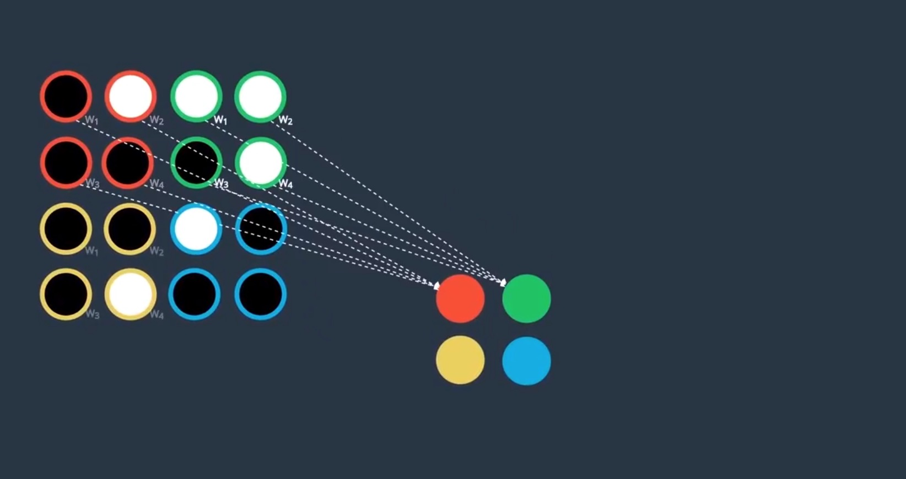
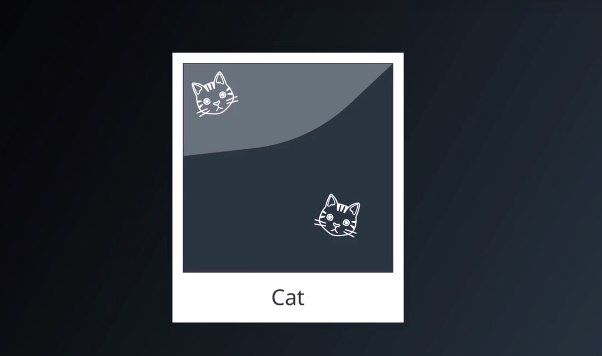
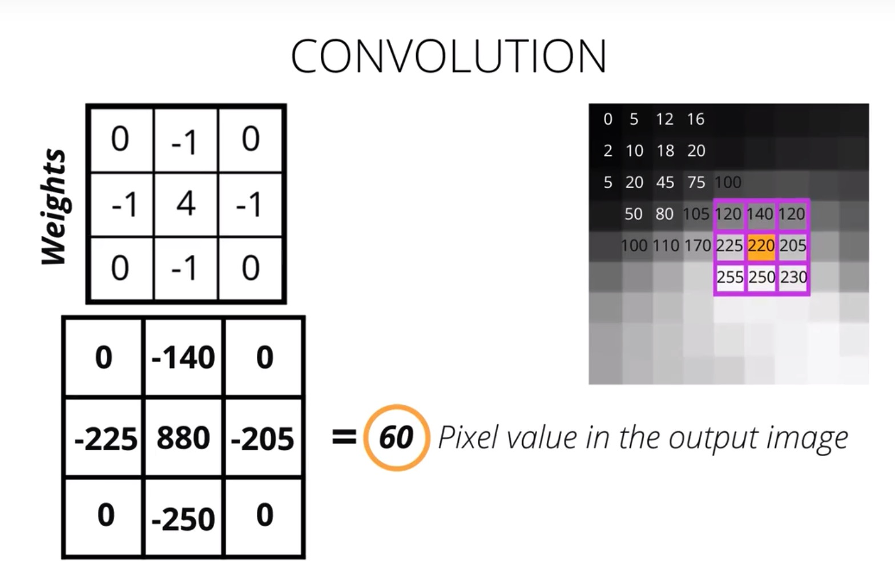
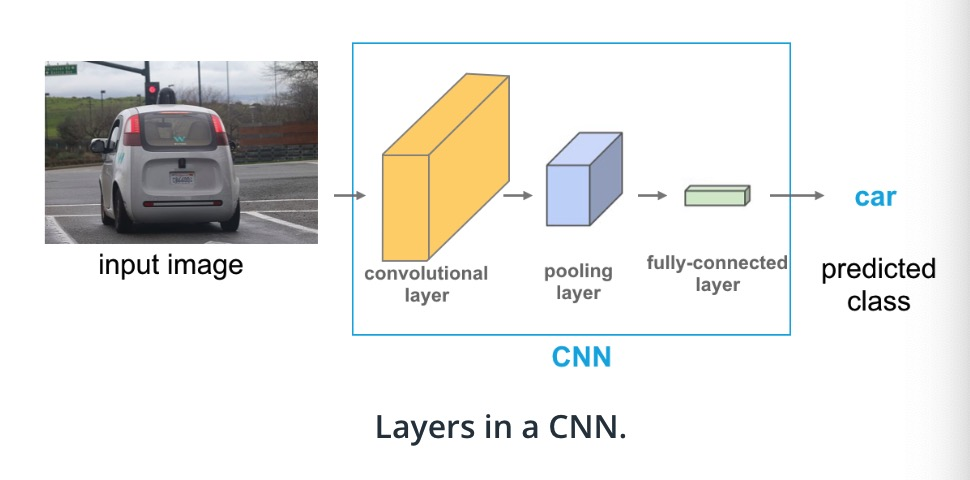

# Convolutional Neural Networks

[TOC]

## Applicaiton of CNNs

- Voice User interfaces

  - Google released WaveNet Model (link)
    - Take any text as input and return computer-generated audio of a human reading in the text
    - if you supply the algorithm with enough samples of your voice, it is possible train it sound like you
    - researchers used a variant of the WaveNet model to generate songs

- Natural Language Processing

  - RNN in general is used more than CNN
  - extract information from sentences
    - this information can be used to classify <u>sentiment</u>
      - is the writer happy or sad
      - if talking about a movie, did they like or dislike it

- computer vision

  - image classification tasks (focus of this video)
    - Given an image, your CNN will assign a corresponding label which you believe summarizes the content of the image
    - Wide applications
      - this teaches AI agents to play video games such as <u>Atari Breakout</u>
        - CNN-based mode are able to learn to play games without being given any prior knowledge of what a ball is, and without even being told precisely what the controls do
        - The agent only see the screen and its score, but it does have access of the control that you would give a human user
        - With these simple information, CNNs can extract crucial information that allows them to develop a useful strategy
      - CNNs have even been trained to play Pictionary
        - Quick draw
          - it guesses what you are drawing based on your finger-drawn picture
      - Go: ancient Chinese board game: considered one of the most complex games in existence
        - it has more configurations in the game than there are atoms in the universe
        - DeepMind: train AI agent to beat human professional Go players
      - Allows drones to navigate unfamiliar territory
        - drone are now used to deliver medical supplies to remote areas
          - CNNs give the drone the ability to see or to determine what's happening in streaming video data
      - Decode images of text (extract text from picture)
        - digitalize the historical book or your handwritten notes
          - we can identify images of letters or numbers or punctuation
          - we can aid self-driving caars with reading road signs
            - Google has built a better more accurate street maps of the world by training an algorithm that can read house numbers sign from street view images
      - In general, CNNs is the state of the art in a lot of cases

- ### Optional Resources

  - Read about the [WaveNet](https://deepmind.com/blog/wavenet-generative-model-raw-audio/) model.
    - Why train an A.I. to talk, when you can train it to sing ;)? In April 2017, researchers used a variant of the WaveNet model to generate songs. The original paper and demo can be found [here](http://www.creativeai.net/posts/W2C3baXvf2yJSLbY6/a-neural-parametric-singing-synthesizer).
  - Learn about CNNs [for text classification](http://www.wildml.com/2015/12/implementing-a-cnn-for-text-classification-in-tensorflow/).
    - You might like to sign up for the author's [Deep Learning Newsletter](https://www.getrevue.co/profile/wildml)!
  - Read about Facebook's [novel CNN approach](https://code.facebook.com/posts/1978007565818999/a-novel-approach-to-neural-machine-translation/) for language translation that achieves state-of-the-art accuracy at nine times the speed of RNN models.

  - Play [Atari games](https://deepmind.com/research/dqn/) with a CNN and reinforcement learning. You can [download](https://sites.google.com/a/deepmind.com/dqn/)the code that comes with this paper.
    - If you would like to play around with some beginner code (for deep reinforcement learning), you're encouraged to check out Andrej Karpathy's [post](http://karpathy.github.io/2016/05/31/rl/).
  - Play [pictionary](https://quickdraw.withgoogle.com/#) with a CNN!
    - Also check out all of the other cool implementations on the [A.I. Experiments](https://aiexperiments.withgoogle.com/) website. Be sure not to miss [AutoDraw](https://www.autodraw.com/)!
  - Read more about [AlphaGo](https://deepmind.com/research/alphago/).
    - Check out [this article](https://www.technologyreview.com/s/604273/finding-solace-in-defeat-by-artificial-intelligence/?set=604287), which asks the question: *If mastering Go “requires human intuition,” what is it like to have a piece of one’s humanity challenged?*
  - Check out these *really cool* videos with drones that are powered by CNNs.
    - Here's an interview with a startup - [Intelligent Flying Machines (IFM)](https://www.youtube.com/watch?v=AMDiR61f86Y).
    - Outdoor autonomous navigation is typically accomplished through the use of the [global positioning system (GPS)](http://www.droneomega.com/gps-drone-navigation-works/), but here's a demo with a CNN-powered [autonomous drone](https://www.youtube.com/watch?v=wSFYOw4VIYY).
  - If you're excited about using CNNs in self-driving cars, you're encouraged to check out:
    - our [Self-Driving Car Engineer Nanodegree](https://www.udacity.com/course/self-driving-car-engineer-nanodegree--nd013), where we classify signs in the [German Traffic Sign](http://benchmark.ini.rub.de/?section=gtsrb&subsection=dataset) dataset in [this project](https://github.com/udacity/CarND-Traffic-Sign-Classifier-Project).
    - our [Machine Learning Engineer Nanodegree](https://www.udacity.com/course/machine-learning-engineer-nanodegree--nd009), where we classify house numbers from the [Street View House Numbers](http://ufldl.stanford.edu/housenumbers/) dataset in [this project](https://github.com/udacity/machine-learning/tree/master/projects/digit_recognition).
    - this [series of blog posts](https://pythonprogramming.net/game-frames-open-cv-python-plays-gta-v/) that details how to train a CNN in Python to produce a self-driving A.I. to play Grand Theft Auto V.
  - Check out some additional applications not mentioned in the video.
    - Some of the world's most famous paintings have been [turned into 3D](http://www.businessinsider.com/3d-printed-works-of-art-for-the-blind-2016-1)for the visually impaired. Although the article does not mention *how* this was done, we note that it is possible to use a CNN to [predict depth](https://www.cs.nyu.edu/~deigen/depth/) from a single image.
    - Check out [this research](https://research.googleblog.com/2017/03/assisting-pathologists-in-detecting.html) that uses CNNs to localize breast cancer.
    - CNNs are used to [save endangered species](https://blogs.nvidia.com/blog/2016/11/04/saving-endangered-species/?adbsc=social_20170303_70517416)!
    - An app called [FaceApp](http://www.digitaltrends.com/photography/faceapp-neural-net-image-editing/) uses a CNN to make you smile in a picture or change genders.

## Lesson Outline

- Improve our ability to classify images

- CNN can look into the picture as a whole, learn to identity <u>spatial pattern</u>
  
  - such as prominent colors and shapes
  - or whether the texture is fuzzy or smooth
- The shapes and colors that define any image and in the object in a image are often called features
- CNN is able to learn this features

<u>What is a feature?</u>

- think of what we are visually drawn to when we first see an object and when we identify different objects
  - e.g. what do we look at to distinguish a cat and a dog
    - the shape of the eyes, the size, and how they move...
  - e.g. we see a person walking toward us and we want to see if it is someone we know
    - we may look at their face, even further their general shape
      - the distinct shape of a person and their eye color are great examples of distingusing features

## MNIST Dataset

- How to recognize a single object in a image
  

- We want to design an image classifier
  - input: image of a hand-written number
  - output: a class of the number
- How to build this
  - use a mnist database
    
- Difficulties in the dataset
  - some "3"s will be recognized as 8
  - some "4" can be recognized as 9
- Deep learning: data-driven approach, train an algorithm that can examine these images and discover patterns that distinguish one number from another
- The algorithm needs to attain some level of understanding of what makes a handdrawn 1 look like a 1
  - and how image of 1 different from image of 2

## How Computers Interpret Images


- images is interpreted as an <u>array</u>
- each box in the image is called a pixel, and it has a value
- MNIST database has pictues with 28 pixels high and 28 pixels wide = 28 x 28 array
- white is encoded as 255, black is encoded as 0


- The image is then passed for a pre-processing step
  - <u>normalization</u>: divide all pixel value with 255
  - range 0 -1 instead of 0 - 255
  - help our algorithm train better
    - rely on gradient calculation
    - learn how important/how weighty a pixel should be determining the class of the image
    - make the gradient calculation more consistent and not get so large to slow down and prevent a network from training
    - **Why normalization?**
      - Ensures that each input (each pixel value, in this case) comes from a standard distribution
      - The range of pixel values in one input image are the same as the range in another image.
      - This standardization makes our model train and reach a minimum error, faster
      - Data normalization is typically done by subtracting the mean (the average of all pixel values) from each pixel, and then dividing the result by the standard deviation of all the pixel values. Sometimes you'll see an approximation here, where we use a mean and standard deviation of 0.5 to center the pixel values. [Read more about the Normalize transformation in PyTorch.](https://pytorch.org/docs/stable/torchvision/transforms.html#transforms-on-torch-tensor)
      - The distribution of such data should resemble a [Gaussian function](http://mathworld.wolfram.com/GaussianFunction.html) centered at zero. 
        - For image inputs we need the pixel numbers to be positive, so we often choose to scale the data in a normalized range [0,1]
- How to classify a image using MLP? **(as it only receives vector as input)**


- convert any image of array to vector
- 4 x 4 matrix
- vector of 16 entries


- The vector can be fed as the input of the MLP

## MLP Structure & Class Scores

<u>Create a neural network for discovering the patterns in our data</u>

After training, our model should be able to look at the images that haven't trained on, which is called the <u>test data</u>


- Input layer:
  - images which are converted into vectors with 784 entries, therefore we have 784 nodes 
- Output layer:
  - 10 different numbers --> so we have 10 nodes --> 10 output values for each of the class


- Output values are often called as "class scores"
  - high scores: the model is very certain that a image falls into certain class
    - e.g. input = 3
      - In the output layer, has high score in class 3 and low score in other classes, 8 may get pretty high scores as 8 looks like 3 in some cases


- output layers can be represented as <u>scores</u> or <u>bar chart</u>
  - indicating the relative strength of the scores


- The things up to we define is inbetween the input and output layers
  - How many hidden layers we want to include?
  - How many nodes we want to have for each hidden layer?


- usually look at the papers or related work as a good guide
- search for
  - MLP for MNIST
  - MLP for small scale grey images

## Do Your Research

- Look into google and find reputable source **(lower case may help me to find better result)**
  - keras + Github (example of good source)
- Look at the code


- Import mnist dataset


- reshape the image


- look at the model
  - <u>**2 layers**</u> with relu activation function
  - dropout inbetween
  - output = number of classes--> softmax


- When we look at the source like this, we try to evaluate whether it makes sense
  - more layers, more complex, but we do not want to be too complex
  - small images --> 2 layers should be fine


- Keep looking at more sources, and see whether we can find a better one and test it in code

## Loss & Optimization


- input = image 2, ouput = different scores for different classes
  - the higher the score, the more certain the image is likely to fall into this category
    - e.g. 8 is the largest (most likely) and 3 is the smallest (least likely)
- However, it is incorrect, we need to learn from mistakes


- Backpropagation: compute the gradient of the loss with respect to the model's weight
  - find out which weight is responsible for any errors
- Optimization function (e.g. gradient descent)


- make this output value more interpretable
  - apply softmax activation function


- then we will get the 10 values bounded in the green box
- our goal is to update the weight of the network and respond to the mistakes, so next time the model will predict 2 is most likely to be the predicted class
- We then need to measure how far our current model is from perfection
  - Loss function
    - we will use categorical cross entropy loss (multi-class classification)
    - take the negative log loss of the value = 1.82
  - backpropagation will find out which weight is responsible for each error


- we get a better value when the prediction is better


- the goal is to minimize the loss function, therefore it can give us the most accurate predictions


- we need to find a way to decent to the lowest value, which is the road of an optimizer


- there are a number of ways to perform gradient descent
- each method has a corresponding optimizer
- All of them are racing towards the minimum of the function
  - encourage to test all of them in your code

## Defining a Network in PyTorch

```python
# import libraries
import torch
import numpy as np
```

Load and visualize the data

```python
# import the torch dataset
from torchvision import datasets 
# import the transformation libraries
import torchvision.transforms as transforms

# number of subprocesses to use for data loading
num_workers = 0
# how many samples per batch to load
batch_size = 20

# convert data to torch.FloatTensor
transform = transforms.ToTensor() 
# Tensor is a similar thing as array, only it can be put into GPU calculation

# choose the training and test datasets
# loading data, download it and transform it
# download the data into a directory called data
train_data = datasets.MNIST(root='data', train=True,
                                   download=True, transform=transform)
test_data = datasets.MNIST(root='data', train=False,
                                  download=True, transform=transform)

# prepare data loaders
train_loader = torch.utils.data.DataLoader(train_data, batch_size=batch_size,
    num_workers=num_workers)
test_loader = torch.utils.data.DataLoader(test_data, batch_size=batch_size, 
    num_workers=num_workers)
```

- batch_size: number of images will be seen in one iteration
  - one iteration means one time that a network makes a mistake and learn from them using backpropagation
- num_workers: if you want to run in parallel, for most cases, zero works fine here
- The data loader takes in the data we define above, batch size and numbr of workers
  - it allows to iterate the data one batch at a time

<u>First step in any image classification task: Visualize a Batch of Training Data</u>


```python
import matplotlib.pyplot as plt
%matplotlib inline
    
# obtain one batch of training images
dataiter = iter(train_loader)
images, labels = dataiter.next()
images = images.numpy()

# plot the images in the batch, along with the corresponding labels
fig = plt.figure(figsize=(25, 4))
for idx in np.arange(20): # plot 20 of them
    ax = fig.add_subplot(2, 20/2, idx+1, xticks=[], yticks=[])
    ax.imshow(np.squeeze(images[idx]), cmap='gray')
    # print out the correct label for each image
    # .item() gets the value contained in a Tensor
    ax.set_title(str(labels[idx].item()))
```

View an Image in More detail


```python
img = np.squeeze(images[1])

fig = plt.figure(figsize = (12,12)) 
ax = fig.add_subplot(111)
ax.imshow(img, cmap='gray')
width, height = img.shape
thresh = img.max()/2.5
for x in range(width):
    for y in range(height):
        val = round(img[x][y],2) if img[x][y] !=0 else 0
        ax.annotate(str(val), xy=(y,x),
                    horizontalalignment='center',
                    verticalalignment='center',
                    color='white' if img[x][y]<thresh else 'black')
```

Defining the Network Architecture (to do)

```python
import torch.nn as nn
import torch.nn.functional as F

## TODO: Define the NN architecture
class Net(nn.Module):
    def __init__(self): 
        super(Net, self).__init__()
        # number of hidden nodes in each layer (512)
        hidden_1 = 512 # optional move
        hidden_2 = 512
        # linear layer (784 -> 1 hidden node)
        self.fc1 = nn.Linear(28 * 28, 1) # 784 entrie, 1 = number of ouput has to 			be changed
        # linear layer (n_hidden -> hidden_2)
        self.fc2 = nn.Linear(hidden_1, hidden_2)
        # linear layer (n_hidden -> 10)
        self.fc3 = nn.Linear(hidden_2, 10)
        # dropout layer (p=0.2)
        # dropout prevents overfitting of data
        self.dropout = nn.Dropout(0.2)

    def forward(self, x):
        # flatten image input
        x = x.view(-1, 28 * 28)
        # add hidden layer, with relu activation function
        x = F.relu(self.fc1(x))
        # add dropout layer
        x = self.dropout(x)
        # add hidden layer, with relu activation function
        x = F.relu(self.fc2(x))
        # add dropout layer
        x = self. dropout(x)
        # add hidden layer, with relu activation function
        x = self.fc3(x)
        return x

# initialize the NN
model = Net()
print(model)
```

Important:

1. init function: 
   - to define any neural network in Pytorch,we need to define names and any layers that have learnt weight
     - e.g. in this case: any linear layers you define
2. feedforward behavior
   - x will be passed through the network and transformed
   - flatten first into desired shape
   - first full connected layer, named as fc1
   - and then add a <u>Relu</u>
     - The purpose of an activation function is to scale the outputs of a layer so that they are a consistent, small value. Much like normalizing input values, this step ensures that our model trains efficiently
     - A ReLu activation function stands for "rectified linear unit" and is one of the most commonly used activation functions for hidden layers. It is an activation function, simply defined as the **positive** part of the input, `x`. So, for an input image with any *negative* pixel values, this would turn all those values to `0`, black. You may hear this referred to as "clipping" the values to zero; meaning that is the lower bound.

## Training the Network

It's recommended that you use cross-entropy loss for classification


softmax to the output and apply negative log

 - it means you only need class scores


- The losses are averaged across observation for each minibatch
  - each batch size = 20, the losses of each training will be the average of 20

documentation of [Loss Function](http://pytorch.org/docs/stable/nn.html#loss-functions) and [Optimizer](http://pytorch.org/docs/stable/optim.html)

```python
## TODO: Specify loss and optimization functions

# specify loss function (categorical cross-entropy)
criterion = nn.CrossEntropyLoss()

# specify optimizer (stochastic gradient descent) and learning rate = 0.01
optimizer = torch.optim.SGD(model.parameters(), lr=0.01)
```

Train the network

```python
# number of epochs to train the model
n_epochs = 30  # suggest training between 20-50 epochs

model.train() # prep model for training

for epoch in range(n_epochs):
    # monitor training loss
    train_loss = 0.0
    
    ###################
    # train the model #
    ###################
    for data, target in train_loader:
        # clear the gradients of all optimized variables
        optimizer.zero_grad()
        # forward pass: compute predicted outputs by passing inputs to the model
        output = model(data)
        # calculate the loss
        loss = criterion(output, target)
        # backward pass: compute gradient of the loss with respect to model parameters
        loss.backward()
        # perform a single optimization step (parameter update)
        optimizer.step()
        # update running training loss
        train_loss += loss.item()*data.size(0)
        
    # print training statistics 
    # calculate average loss over an epoch
    train_loss = train_loss/len(train_loader.dataset)

    print('Epoch: {} \tTraining Loss: {:.6f}'.format(
        epoch+1, 
        train_loss
        ))
```

- n_epochs: means how many times will you go through the dataset
  - small to large, keep track of the running loss
- inside the epoch loop is the batch loop
- train loader
  - we can look at the data and its label in that batch
- Clear out any gradient calculation that pytorch has accumulated 
  - `.zero_grad()`
- forward pass
  - mode(data)
  - output = scores
- loss function -- > calculate the entropy loss
  - compare the ouput and the true label
- backpropagation, sinple optimization step
- running trainig loss (accumulated loss)
  - since the function return the average, so we need to multiply by the batch size
- After the batch loop, calculate the average loss of the epoch
  - divide the accumulate loss by total number of images in the training set
- and we will print it accumulate loss

Test

```python
# initialize lists to monitor test loss and accuracy
test_loss = 0.0
class_correct = list(0. for i in range(10))
class_total = list(0. for i in range(10))

model.eval() # prep model for *evaluation*

for data, target in test_loader:
    # forward pass: compute predicted outputs by passing inputs to the model
    output = model(data)
    # calculate the loss
    loss = criterion(output, target)
    # update test loss 
    test_loss += loss.item()*data.size(0)
    # convert output probabilities to predicted class
    _, pred = torch.max(output, 1)
    # compare predictions to true label
    correct = np.squeeze(pred.eq(target.data.view_as(pred)))
    # calculate test accuracy for each object class
    for i in range(batch_size):
        label = target.data[i]
        class_correct[label] += correct[i].item()
        class_total[label] += 1

# calculate and print avg test loss
test_loss = test_loss/len(test_loader.dataset)
print('Test Loss: {:.6f}\n'.format(test_loss))

for i in range(10):
    if class_total[i] > 0:
        print('Test Accuracy of %5s: %2d%% (%2d/%2d)' % (
            str(i), 100 * class_correct[i] / class_total[i],
            np.sum(class_correct[i]), np.sum(class_total[i])))
    else:
        print('Test Accuracy of %5s: N/A (no training examples)' % (classes[i]))

print('\nTest Accuracy (Overall): %2d%% (%2d/%2d)' % (
    100. * np.sum(class_correct) / np.sum(class_total),
    np.sum(class_correct), np.sum(class_total)))
```

Test the trained network

`model.eval(`) will set all the layers in your model to evaluation mode. This affects layers like dropout layers that turn "off" nodes during training with some probability, but should allow every node to be "on" for evaluation!

```python
# initialize lists to monitor test loss and accuracy
test_loss = 0.0
class_correct = list(0. for i in range(10))
class_total = list(0. for i in range(10))

model.eval() # prep model for *evaluation*

for data, target in test_loader:
    # forward pass: compute predicted outputs by passing inputs to the model
    output = model(data)
    # calculate the loss
    loss = criterion(output, target)
    # update test loss 
    test_loss += loss.item()*data.size(0)
    # convert output probabilities to predicted class
    _, pred = torch.max(output, 1)
    # compare predictions to true label
    correct = np.squeeze(pred.eq(target.data.view_as(pred)))
    # calculate test accuracy for each object class
    for i in range(batch_size):
        label = target.data[i]
        class_correct[label] += correct[i].item()
        class_total[label] += 1

# calculate and print avg test loss
test_loss = test_loss/len(test_loader.dataset)
print('Test Loss: {:.6f}\n'.format(test_loss))

for i in range(10):
    if class_total[i] > 0:
        print('Test Accuracy of %5s: %2d%% (%2d/%2d)' % (
            str(i), 100 * class_correct[i] / class_total[i],
            np.sum(class_correct[i]), np.sum(class_total[i])))
    else:
        print('Test Accuracy of %5s: N/A (no training examples)' % (classes[i]))

print('\nTest Accuracy (Overall): %2d%% (%2d/%2d)' % (
    100. * np.sum(class_correct) / np.sum(class_total),
    np.sum(class_correct), np.sum(class_total)))

>>output:
    Test Loss: 0.055157

Test Accuracy of     0: 99% (971/980)
Test Accuracy of     1: 99% (1125/1135)
Test Accuracy of     2: 98% (1014/1032)
Test Accuracy of     3: 98% (994/1010)
Test Accuracy of     4: 98% (963/982)
Test Accuracy of     5: 98% (877/892)
Test Accuracy of     6: 98% (940/958)
Test Accuracy of     7: 97% (1006/1028)
Test Accuracy of     8: 97% (946/974)
Test Accuracy of     9: 97% (988/1009)

Test Accuracy (Overall): 98% (9824/10000)
```

Visualize Sample Test Results

```python
# obtain one batch of test images
dataiter = iter(test_loader)
images, labels = dataiter.next()

# get sample outputs
output = model(images)
# convert output probabilities to predicted class
_, preds = torch.max(output, 1)
# prep images for display
images = images.numpy()

# plot the images in the batch, along with predicted and true labels
fig = plt.figure(figsize=(25, 4))
for idx in np.arange(20):
    ax = fig.add_subplot(2, 20/2, idx+1, xticks=[], yticks=[])
    ax.imshow(np.squeeze(images[idx]), cmap='gray')
    ax.set_title("{} ({})".format(str(preds[idx].item()), str(labels[idx].item())),
                 color=("green" if preds[idx]==labels[idx] else "red"))
```

## Model Validation


- The exact epoch to stop training is hard to determine
- Criteria
  - accurate but not overfitting


- Divide the dataset into training, validation and test set
- After training, we look at the loss of both training set and validation set
  - **We do not use any part of the validation set for back propagation**
    - so that it is possible to tell us whether our model can be generalized
  - we try to find all patterns in the training set


- The part the training loss is decreasing and validation loss is increasing
  - Overfitting


If we have multiple architectures to choose from (e.g number of layer)

- save the weight of each architecture
- **pick the model with the lowest validation loss

Why we need to create validation instead of simply using the test set?

- Because in the test set, we are checking whether the model is able to generalize for the trully unseen data

## Validation Loss

<u>What should be added to the code?</u>

1. Load and Visualize the Data

   ```python
   from torchvision import datasets
   import torchvision.transforms as transforms
   from torch.utils.data.sampler import SubsetRandomSampler # split the training data --------> (CHANGED)
   
   # number of subprocesses to use for data loading
   num_workers = 0
   # how many samples per batch to load
   batch_size = 20
   # percentage of training set to use as validation # ----------> (CHANGED)
   valid_size = 0.2 
   
   # convert data to torch.FloatTensor
   transform = transforms.ToTensor()
   
   # choose the training and test datasets
   train_data = datasets.MNIST(root='data', train=True,
                                      download=True, transform=transform)
   test_data = datasets.MNIST(root='data', train=False,
                                     download=True, transform=transform)
   
   # obtain training indices that will be used for validation
   num_train = len(train_data) # -----> how many training images (CHANGED)
   indices = list(range(num_train)) # List out all indices ------> (CHANGED)
   np.random.shuffle(indices) # shuffle ---------> (CHANGED)
   split = int(np.floor(valid_size * num_train)) # --->Split (CHANGED)
   train_idx, valid_idx = indices[split:], indices[:split] # -> Split (CHANGED)
   
   # define samplers for obtaining training and validation batches
   train_sampler = SubsetRandomSampler(train_idx) # -----> CHANGED
   valid_sampler = SubsetRandomSampler(valid_idx) # -----> CHANGED
   
   # prepare data loaders
   train_loader = torch.utils.data.DataLoader(train_data, batch_size=batch_size,
       sampler=train_sampler, num_workers=num_workers) # add sampler argument (CHANGED)
   valid_loader = torch.utils.data.DataLoader(train_data, batch_size=batch_size, 
       sampler=valid_sampler, num_workers=num_workers) # add validation dataset loader
   test_loader = torch.utils.data.DataLoader(test_data, batch_size=batch_size, 
       num_workers=num_workers)
   ```

2. Train the network

   ```python
   # number of epochs to train the model
   n_epochs = 50
   
   # initialize tracker for minimum validation loss
   valid_loss_min = np.Inf # set initial "min" to infinity ----> check the change of validation loss, guarantee it will update after the first epoch(CHANGED)
   
   for epoch in range(n_epochs):
       # monitor training loss
       train_loss = 0.0
       valid_loss = 0.0
       
       ###################
       # train the model #
       ###################
       model.train() # prep model for training
       for data, target in train_loader:
           # clear the gradients of all optimized variables
           optimizer.zero_grad()
           # forward pass: compute predicted outputs by passing inputs to the model
           output = model(data)
           # calculate the loss
           loss = criterion(output, target)
           # backward pass: compute gradient of the loss with respect to model parameters
           loss.backward()
           # perform a single optimization step (parameter update)
           optimizer.step()
           # update running training loss
           train_loss += loss.item()*data.size(0)
           
       ######################    
       # validate the model # -----> validation batch loop (CHANGED)
       ######################
       model.eval() # prep model for evaluation
       for data, target in valid_loader:
           # forward pass: compute predicted outputs by passing inputs to the model
           output = model(data)
           # calculate the loss
           loss = criterion(output, target)
           # update running validation loss 
           valid_loss += loss.item()*data.size(0)
           
       # print training/validation statistics 
       # calculate average loss over an epoch
       train_loss = train_loss/len(train_loader.dataset)
       valid_loss = valid_loss/len(valid_loader.dataset)
       
       print('Epoch: {} \tTraining Loss: {:.6f} \tValidation Loss: {:.6f}'.format(
           epoch+1, 
           train_loss,
           valid_loss
           )) # also print the validation loss (CHANGED)
       
       # save model if validation loss has decreased
       if valid_loss <= valid_loss_min:
           print('Validation loss decreased ({:.6f} --> {:.6f}).  Saving model ...'.format(
           valid_loss_min,
           valid_loss))
           torch.save(model.state_dict(), 'model.pt')
           valid_loss_min = valid_loss # store the model when there is a new minimum as model.pt ---> (CHANGED)
   ```

   ```python
   
   Validation loss decreased (0.017454 --> 0.016991).  Saving model ...
   Epoch: 26 	Training Loss: 0.030163 	Validation Loss: 0.016554
   Validation loss decreased (0.016991 --> 0.016554).  Saving model ...
   Epoch: 27 	Training Loss: 0.028369 	Validation Loss: 0.017595
   Epoch: 28 	Training Loss: 0.026245 	Validation Loss: 0.016682
   Epoch: 29 	Training Loss: 0.025983 	Validation Loss: 0.017080
   Epoch: 30 	Training Loss: 0.024357 	Validation Loss: 0.016169
   Validation loss decreased (0.016554 --> 0.016169).  Saving model ...
   Epoch: 31 	Training Loss: 0.022118 	Validation Loss: 0.016334
   Epoch: 32 	Training Loss: 0.023228 	Validation Loss: 0.016612
   Epoch: 33 	Training Loss: 0.020928 	Validation Loss: 0.016693
   Epoch: 34 	Training Loss: 0.019909 	Validation Loss: 0.016322
   Epoch: 35 	Training Loss: 0.018557 	Validation Loss: 0.016833
   Epoch: 36 	Training Loss: 0.018037 	Validation Loss: 0.016070
   Validation loss decreased (0.016169 --> 0.016070).  Saving model ...
   Epoch: 37 	Training Loss: 0.017053 	Validation Loss: 0.015298 
   Validation loss decreased (0.016070 --> 0.015298).  Saving model ... # after this, the loss is more or less similar
   Epoch: 38 	Training Loss: 0.016680 	Validation Loss: 0.016685
   Epoch: 39 	Training Loss: 0.015662 	Validation Loss: 0.016136
   Epoch: 40 	Training Loss: 0.015871 	Validation Loss: 0.016163
   ```

3. Load the Model with Lowest Validation Loss

   ```python
   model.load_state_dict(torch.load('model.pt')) # CHANGED
   ```

   - The result is similar without validation, as the loss doesn't change much
     - the images in this case is very similar, very preprocessed, the digit look pretty much the same
   - Validation step will become more important when there is a higher variety of the dataset

## Image Classification Steps

<u>Full pipeline</u>


## MLPs vs CNNs

- CNN usually perform so much better than MLP in the real world dataset (they cannot be compared)

- highest accuarcy in MNIST

  - 

    - MLP performs very well in the very organized dataset like MNIST

    

    - there should be situation in which data does not lie in the middle of the grid, it can be small and large
    - In these cases, CNN truely shines
    - Why?

    

    - feed image to MLP
    - first convert the image into vector
      - just a simple structure of numbers with no special structure
      - it has no knowledge in that fact that the number is spatially arranged in a grid
    - CNN are builiding on recognizing multidimentional data
    - CNN understands image pixel that are close together are mostly related than the ones far apart

## Local Connectivity - towards motivating and defining CNNs


| MLP                                                          | CNNs                                                         |
| ------------------------------------------------------------ | ------------------------------------------------------------ |
| - use a lot of parameters, for 28x28 images, already contained over half a milion parameters<br />- computational complexity of moderately sized imags could get out of control easily<br />- Throw away all of the 2D information contained in an image when we flatten its matrix into a vector | - Yet, this spatial information or knowledge where the pixels are located in reference ot each other is relevant to understanding the image and could aid significantly towards elucidating the patterns contained in the pixel values.<br/>- That is why we need an entirely new way of processing image input, where the 2-D information is not entirely lost<br />- features:<br />1. connections between layers are informed by the 2-D structure of the image matrix<br />2. accept matrix as input |


- Example: 4 x 4 images of handwritten digits
- goal is to classify the digit that's depicted in the image
- Right to left
  - 4 x 4 matrix has been converted to a 16 dimensional vector
  - MLP
    - input: 16 dimension vector
    - middle: single hidden layer with 4 nodes
    - output: softmax activation function and returns a 10-dimensional vector
      - it then contains the probability that the image depicts each of the possible digits zero through nine
        - if the model is good --> predict a seven most probably
        - simplication as follows


- There may be some redundancy
  - **does every hidden node need to be connected to every pixel in the original image**
  - perhaps not, we can break the image into four regions


- four regions include 1) red, 2) green, 3) yellow and 4) blue
- each hidden node could be connected to only the pixels in one of these four regions
- Here, each headed node sees only a quarter of the original image


- again comparing with the previous mentioned fully-connected layer, an understanding of the entire image all at once
- the new regional breakdown and the assignment of small local groups of pixels to different hidden nodes, every hidden node finds patterns in only one of the four region in the image
- Then, each hidden node still reports to the output layer where the output layer combines the findings for the discovered patterns learned separately in each region
- The above is called locally connected layer
  - it uses far fewer parameters than a densely connected layer
  - It is then less prone to overfitting and truly understands how to tease out the patterns contained in image data.


- **we can rearrange each of these vectors as a matrix**
  - The relationships between the nodes in each layer are more obvious
  - We could expand the number of patterns that we are able to detect while still making use of the 2-D structure to selectively and conversatively add weights to the model by introducing more hidden nodes, where each is still confined to analyzing a single small region within the image
  - After all, by expanding the number nodes in the hidden layer, we can discover more complex patterns in our data
  - As shown in the above, we now have two collections of hidden nodes where each collection contains nodes responsible for examing a different region of the image.



- it will prove useful to have each of the hidden nodes within a collection share a common group of weights
- The idea being that different regions within the image can share the same kind of information
  - it means evey pattern that's relevant towards understanding the image could appear anywhere within the image



- Example
  - you want your network to say it's an image containing a cat
    - it does not matter where the cat is
      - if your network need to learn the cat located on the left corner or the right corner independently, that's a lot of work that it has to do
    - Instead, we tell the network explicity that objects and images are largely the same whether they are on the left or the right of the picture
      - this is partially accomplished through weight sharing

## Filters and the Convolutional Layer

- CNN is a special kind of neural network that it can remember spacial information
- The neural networks mentioned before only look at the individual input
- CNN can look at the image as a whole or in batches and analyze in groups of pixels in a time


- The key to preserve spacial information is the convolutional layer
- convolutionay layer applies a series of image filters, also known as convolutional kernels


- The resulting filtered images have different experiences
- The filters may have extracted features such as
  - edges of object
  - the color that is distinguished from different classes


​

- spacial information such as the curves and lines that a 6 has to distinguish from other numbers
- Later layers learn combine different colors and spacial features to produce an output like a class signal

## Filtes & Edges

- When we are talking about spacial pattern of an image
  - color or shape
- Shape
  - it can thought of as pattern of intensity of an image
    - intensity is a measure of dark and light similar to brightness
      - we use this to detect the shape of an object
        - e.g. distinguish a person from a background in a image
          - we can look at the contrast that occurs at the person ends and the background begins. to define the boundary that separate the two
          - we can often identify the edges of an image by looking an abrupt change of intensity (image from very dark to white area)
  - image filter that looks at groups of pixels and detect big changes in intensity in an image
  - The output shows the edges of objects and differing textures
    - show various edges and shapes

## Frequency in images

- For sound, frequency actually refers to how fast a sound wave is oscillating; oscillations are usually measured in cycles/s ([Hz](https://en.wikipedia.org/wiki/Hertz)), and high pitches and made by high-frequency waves
-  frequency in images is a **rate of change**
  -  images change in space, and a high frequency image is one where the intensity changes a lot.
  - And the level of brightness changes quickly from one pixel to the next.
  - A low frequency image may be one that is relatively uniform in brightness or changes very slowly
- Most images have both high-frequency and low-frequency components. 
  - In the image above, on the scarf and striped shirt, we have a high-frequency image pattern; this part changes very rapidly from one brightness to another.
  - igher up in this same image, we see parts of the sky and background that change very gradually, which is considered a smooth, low-frequency pattern.
  - **High-frequency components also correspond to the edges of objects in images**, which can help us classify those objects.

## High-pass Filters


- In image processin, filters are used to filter out unwanted or irrelevant information in an image
- amplify features like object boundaries or other distinguishing traits


- High-pass filters are used to make an image appear sharper and enhance high-frequency parts of an image, which are areas where the levels of intensity in neighboring pixel rapidly change like very dark to very light pixels
- Since we are looking at patterns of intensity, the filters we will be working with will be operating on grayscale in greyscale images that represent this information and display paatterns of lightness and darkness format


- There is no change or a little change in intensity in the original picture,such as in the large areas of dark and light
  - A high-pass filter will black these areas out and the pixels back
  - But in certain areas where a pixel is way brighter than its immediate neighbours, the high-pass filter will enhance that change and create a line
  - we can then see that this has the effect of emphasizing edges


- How does it work?
  - It's a 3 x 3 kernel whose elements all sum to zero
  - **It is important that for edge detection all of the elements sum to zero**
  - In this case, subtracting the value of the pixels that surround a certain pixel
  - **if these kernel values did not add up to zero**


- positively weighted (brightening)


- negatively weighted (darkening the entire filtered image respectively)


To apply this fitler, an input image F(xy) is convolved with this kernel

- The convolution is represented by an asterisk, (note that not to be mistaken for a multiplication)
- kernel convolution is an important operation in computer vision applications and it is the basis for convolutional neural networks


- It involves taking a kernel, which is our small grid of numbers and passing it over an image pixel by pixel transforming it based on what these numbers are 
- We will see that by changing numbers


- To zoom in


- For every pixel in this greyscale image, we put our kernel over it so that the **pixel is in the center of the kernel** (220 in this case)



- Multiplication
  -  0 * 120
  - -1 * 140
  - 0 * 120
  - -1 * 225
  - 4 * 220
- Sum
  - add all the values up
  - **60 means a very small edge has been detected**
    - because it only changes from light at the bottom to a little dark on top
- **These multiples in our kernel are often called ==weights== because they determine how important or how weighty a pixel is in forming a new output images**
  - in this case, for edge detection
    - the center pixel is the most important
    - followed by its closest pixels on the top and bottom and its left and right, which are negative weights that increase the contrast in the image
    - The corners are the farthest away from the center pixel and in this example, we do not give them any weight


- We do this for every pixel position in the original image until you have a complete output image that's about the same size as the input image with new filtered pixel values


- What we need to concern?

  - weighted sum
  - What to do at the edges and corners of your image since the kernel cannot be nicely laid over 3 x 3 pixel values everywhere

- There are number of ways to process edges (the most common ones are shown as below)

  - **Extend**:
    -  The nearest border pixels are conceptually extended as far as necessary to provide values for the convolution. Corner pixels are extended in 90° wedges. Other edge pixels are extended in lines.
  - **Padding**:
    -  The image is padded with a border of 0's, black pixels.

  - **Crop**:
    -  Any pixel in the output image which would require values from beyond the edge is skipped. This method can result in the output image being slightly smaller, with the edges having been cropped.

## Quiz: Kernels


Answer = D

- This kernel finds the difference between the top and bottom edges surrounding a given pixel.

## OpenCV & Creating Custom Filters

- Introduction of OpenCV

  - it is a **computer vision and machine learning software library** that includes many common image analysis algorithms that will help us build custom, intelligent computer vision applications.
  - To start with, this includes tools that help us process images and select areas of interest

  ```python
  import cv2
  ```

  - Goal of next session
    - Define your own convolutional filters and apply them to an image of a road
    - See if you can define filters that detect horizontal or vertical edges

## Notebook: Finding Edges

<u>Import resources and display image</u>

```python
import matplotlib.pyplot as plt
import matplotlib.image as mpimg

import cv2 # OpenCV
import numpy as np

%matplotlib inline

# Read in the image
image = mpimg.imread('images/curved_lane.jpg') # how to read an image

plt.imshow(image)
```


<u>Convert the image to grayscale</u>

```python
# Convert to grayscale for filtering
gray = cv2.cvtColor(image, cv2.COLOR_RGB2GRAY)

plt.imshow(gray, cmap='gray')
```


<u>Create a custom kernel</u>


```python
# Create a custom kernel

# 3x3 array for edge detection
sobel_y = np.array([[ -1, -2, -1], 
                   [ 0, 0, 0], 
                   [ 1, 2, 1]])

## TODO: Create and apply a Sobel x operator
sobel_x = np.array([[-1,0,1],[0,0,0],[-1,0,1]])


# Filter the image using filter2D, which has inputs: (grayscale image, bit-depth, kernel)  
filtered_image = cv2.filter2D(gray, -1, sobel_y) # either sobel_y or sobel_x

plt.imshow(filtered_image, cmap='gray')
```


<u>Create other filters (5x5)</u>

```python
sobel_z = np.array([[-1,-2,-2,-2,-1],
                     [0,0,0,0,0],
                    [0,0,0,0,0],
                    [0,0,0,0,0],
                    [1,2,2,2,1]])
filtered_image_1 = cv2.filter2D(gray, -1, sobel_z)

plt.imshow(filtered_image_1, cmap='gray')
```


## Convolutional Layer (The importance of Filters)

- different types of filters will be really important as you progress through this course
-  CNNs are a kind of deep learning model that can learn to do things like image classification and object recognition
- They keep track of spatial information and *learn* to extract features like the edges of objects in something called a **convolutional layer**.
- Below you'll see an simple CNN structure, made of multiple layers, below, including this "convolutional layer".



<u>Convolutional Layer</u>

It is produced by applying a series of many different image filters, also known as convolutional kernels, to an input image


- In the example shown, 4 different filters produce 4 differently filtered output images
- we stack these images, we form a complete convolutional layer with a depth of 4


- From the previous code example, we have been setting the values of filter weights explicitly
- Neural networks will actually *learn* the best filter weights as they train on a set of image data
- high-pass and low-pass filters are what define the behavior of a network like this, and you know how to code those from scratch!
- you'll also find that many neural networks learn to detect the edges of images because **the edges of object contain valuable information about the shape of an object**

## Convolutional Layers (Part 2)


- A single region of this image may have different patterns that we want to detect
- Like the image shown above, this region has teeth some whisker, and a tongue
- To understand this image, we <u>need filters for detecting all three of these characteristics</u>
  - one for each of teeth, whiskers and tongue


- each blue dot represents the output of the kernel when it moves across and along the picture
- Where we just populate an additional collection of nodes in the convolutional layer
  - this collection has its own shared set of weights that differ from the weights that differ from the weights for the blue nodes above them
- It is common to have tens to hundreds of these collections in a convolutional layer, each corresponding to their own filter
- each filter is formatted in the same way as an image, namely as a matrix of values


- Say if we are working with an image of a self-driving car as input
  - 4 filters, each 4 pixels high and 4 pixels wide
- Each filter will be convolved across the height and width of the image to produce an entire collection of nodes in the convolutional layer


- Since we have 4 filters, we will have 4 collections of nodes
- In practice, we refer each of these four collections is either feature maps or as activation maps


- When we visualize the feature map, we see that they look like filtered images
- That is we have <u>taken all of the complicated dense information</u> in these four cases <u>ouputted a much simpler image with less information</u>
- The first two filters discover vertical edges
- The last two filters detect horizontal edges in the image
- Can we match the lighter resions in each feature map with their corresponding areas in the original image
- In the bottom left image, we can see a clear white line defining the right edge of the car
  - This is because the corresponding regions in the car image closely resemble the filter
    - where we have a vertical line of dark pixels to the left of a vertical line of lighter pixels


- we will soon notice that edges in images appear as a line of lighter pixels next to a line of darker pixels
- This image for instance contains many regions that would be discovered or detected by one of the four filters we defined before
- Filters that function as edge detectors are very important in CNNs and we will revisit them later
- So the above shows that how should we understand convolutional layers that have a grayscale image input
- What about color images?


- gray images are interpreted by the computer as a 2D array with height and width


- Color images are interpreted by the computer as a 3D array with height, width and depth
- This 3D array is best conceptualized as **a stack of three 2D matrices**, where we have matrices correponding to the red,green and blue channels of the image
- How do we perform a convolution on a color image?


- As was the case with grayscale images, we still move a filter horizontally and vertically across the image


- Only now the filter is itself three-dimensional to have a value for each color channel at each horizontal and vertical location in the image array (stack of three 2D matrices)
- We can also think of the filter as a stack of three two-dimensional matrices
- Both the color image and the filter have red, green and blue channels


- Now, to obtain the values of the nodes in the feature map corresponding to this filter
- we do pretty much the same thing we did before
- only now, our sum is over three times as many terms
- here we have depicted the calculation of the value of <u>a single node in a convolutional layer</u> for <u>one filter on a color image</u>


- If we wanted to picture the case of a color image with multiple filters
- instead of having a single 3D array, which corresponds to one filter, we would define multiple 3D arrays, each defining a filter (here we depicted three filters)
  - we can think of a stack of three 2D arrays


- You can think of each of the feature maps in a convolutional layer along the same lines as an image channel and stack them to get a 3D array.


- We can use this 3D array as input to still another convolutional layer to discover patterns within the patterns that we discovered in the first convolutional layer
- We can then do this again to discovr patterns within patterns within patterns

<u>Conclusions</u>

- convolutional layer are not too different from the dense layers that you saw in the previous section
- Dense layers are fully connected
  - the nodes are connected to every node in the previous layer
- Convolutional layer
  - locally connected
    - nodes are connected to only a small subsets of the previous layers' nodes
  - it also had this added parameter sharing
- In both cases, inference works the same way
  - both have weights and biases that aarae initially randomly generated
    - CNNs case
      - **where the weights take the form of convolutional filters, those filters are randomly generated and so are the patterns that they are initially designed to detect**
    - As with MLPs, when we constructed to CNN, we will always specify a loss function
      - In the case of multiclass classification, this will be categorical cross-entropy loss
      - As we train the model through back propagation, the filters are updated as each epoch to take on values that minimize the loss function
      - In other words, **the CNN determines what kind of patterns it needs to detect based on the loss function**
        - if our dataset contains dogs, the CNN is able to on its own, learn filters that look like dogs
    - **Therefore for CNN, we won't specify the values of the filters or tell the CNN what kind of patterns it needs to detect. These will be learned from the data**

<u>Extra Resources:</u>

http://setosa.io/ev/image-kernels/

- The above website allows us to create our own filter
- we can use our webcam as input to a convolutional layer and visualize the corresponding activation map

## Stride and Padding

We can control the behaviour of the convolutional network by specifying 

- The number of filter
  - increase number of nodes of the network
- The size of filter
  - increase the size of the detective pattern

There are more hyperparameters:

- Stride of the convolution network
  - amount for which the filter slide
    - the filter move horizontally and vertically


- **A stride of 1** makes the convolutional layer <u>roughly</u> the same the width and height of the input image
  - the purple box stands for the stacked feature maps


- **A stride of 2** makes the convolutional layer is <u>roughly</u> about half the width and height of the input image
  - we say roughly because it depends how do we process at the edge of the image


To see how we process the edges matter

- Below is a gray scale 5x5 image
  - we have a filter with height and weight = 2
  - If the stride  = 2:
    - When the filter move over the edge, the filter is extended out of boundary, and we label as question marks


- How do we deal with these question marked nodes
  1. we can get rid of the question mark nodes, but we might lose some information of the input image
     - right and bottom edge of the image


2. second option is to padding missing part with zeros, so this can give fitler more spaces to move
   1. so we get contributions from all nodes of the input image


## Pooling Layers


- Pooling layers usually take convolutional layers as input


- Convolutional layer is often called as a stack of feature maps
  - where we have one feature map for each filter


- Many different object categories might require a large number of filters
  - each responsible to find a pattern in the image
- More fitlers mean a bigger stack, which means the dimensionality of the convolutional layer can get quite large, higher dimensionality means we need to get more parameters, which can lead to overfitting
- So we need a method to reduce the dimensionality, which is called the pooling layer
- There are different types of pooling layer
- The following is the max pooling layer


- Max pooling layer will take a stack of feature maps as input
- we will define the window size an stride
- Let's start with the first feature map, take the maximum of the pixels contained in the window
  - 1,9,5,4 --> 9
  - 6,4,7,8 --> 8


- the height and width will be halve of that of the previous convolutional network

<u>Other kinds of pooling</u>

- It is worth noting that some architectures  choose to use [average pooling](https://pytorch.org/docs/stable/nn.html#avgpool2d), which chooses to average pixel values in a given window size
  -  in a 2x2 window, this operation will see 4 pixel values, and return a single, average of those four values, as output
- However, this kind of pooling is <u>typically not used for image classification problems</u> because maxpooling is better at <u>noticing the most important details</u> about edges and other features in an image, but you may see this used in applications for which *smoothing*an image is preferable.

## Notebook: Layer Visualization

<u>Convolutional Layer Visualization</u>


<u>Import the image</u>

```python
import cv2
import matplotlib.pyplot as plt
%matplotlib inline

# TODO: Feel free to try out your own images here by changing img_path
# to a file path to another image on your computer!
img_path = 'data/udacity_sdc.png'

# load color image 
bgr_img = cv2.imread(img_path)
# convert to grayscale
gray_img = cv2.cvtColor(bgr_img, cv2.COLOR_BGR2GRAY)

# normalize, rescale entries to lie in [0,1]
gray_img = gray_img.astype("float32")/255

# plot image
plt.imshow(gray_img, cmap='gray')
plt.show()
```

<u>Define and visualize the filter</u>

```python
import numpy as np

## TODO: Feel free to modify the numbers here, to try out another filter!
filter_vals = np.array([[-1, -1, 1, 1], [-1, -1, 1, 1], [-1, -1, 1, 1], [-1, -1, 1, 1]])

print('Filter shape: ', filter_vals.shape)

```

```python
# Defining four different filters, 
# all of which are linear combinations of the `filter_vals` defined above

# define four filters
filter_1 = filter_vals
filter_2 = -filter_1
filter_3 = filter_1.T
filter_4 = -filter_3
filters = np.array([filter_1, filter_2, filter_3, filter_4])

# For an example, print out the values of filter 1
print('Filter 1: \n', filter_1)
```

```python
# visualize all four filters
fig = plt.figure(figsize=(10, 5))
for i in range(4):
    ax = fig.add_subplot(1, 4, i+1, xticks=[], yticks=[])
    ax.imshow(filters[i], cmap='gray')
    ax.set_title('Filter %s' % str(i+1))
    width, height = filters[i].shape
    for x in range(width):
        for y in range(height):
            ax.annotate(str(filters[i][x][y]), xy=(y,x),
                        horizontalalignment='center',
                        verticalalignment='center',
                        color='white' if filters[i][x][y]<0 else 'black')
```


<u>Define a convolutional layer</u>

Initialize a single convolutional layer so that it contains all your created filters. Note that you are not training this network; you are initializing the weights in a convolutional layer so that you can visualize what happens after a forward pass through this network!

#### `__init__` and `forward`

To define a neural network in PyTorch, you define the layers of a model in the function `__init__`and define the forward behavior of a network that applyies those initialized layers to an input (`x`) in the function `forward`. In PyTorch we convert all inputs into the Tensor datatype, which is similar to a list data type in Python.

Below, I define the structure of a class called `Net` that has a convolutional layer that can contain four 3x3 grayscale filters.

```python
import torch
import torch.nn as nn
import torch.nn.functional as F
    
# define a neural network with a single convolutional layer with four filters
class Net(nn.Module):
    
    def __init__(self, weight):
        super(Net, self).__init__()
        # initializes the weights of the convolutional layer to be the weights of the 4 defined filters
        k_height, k_width = weight.shape[2:]
        # assumes there are 4 grayscale filters
        self.conv = nn.Conv2d(1, 4, kernel_size=(k_height, k_width), bias=False)
        self.conv.weight = torch.nn.Parameter(weight)

    def forward(self, x):
        # calculates the output of a convolutional layer
        # pre- and post-activation
        conv_x = self.conv(x)
        activated_x = F.relu(conv_x)
        
        # returns both layers
        return conv_x, activated_x
    
# instantiate the model and set the weights
weight = torch.from_numpy(filters).unsqueeze(1).type(torch.FloatTensor)
model = Net(weight)

# print out the layer in the network
print(model)

>>output
Net(
  (conv): Conv2d(1, 4, kernel_size=(4, 4), stride=(1, 1), bias=False)
)
```

The ouput of a convolutional layer before and after a ReLu activation function is applied

```python
# plot original image
plt.imshow(gray_img, cmap='gray')

# visualize all filters
fig = plt.figure(figsize=(12, 6))
fig.subplots_adjust(left=0, right=1.5, bottom=0.8, top=1, hspace=0.05, wspace=0.05)
for i in range(4):
    ax = fig.add_subplot(1, 4, i+1, xticks=[], yticks=[])
    ax.imshow(filters[i], cmap='gray')
    ax.set_title('Filter %s' % str(i+1))

    
# convert the image into an input Tensor
gray_img_tensor = torch.from_numpy(gray_img).unsqueeze(0).unsqueeze(1)

# get the convolutional layer (pre and post activation)
conv_layer, activated_layer = model(gray_img_tensor)

# visualize the output of a conv layer
viz_layer(conv_layer)
```

#### ReLu activation

In this model, we've used an activation function that scales the output of the convolutional layer. We've chose a ReLu function to do this, and this function simply turns all negative pixel values in 0's (black). See the equation pictured below for input pixel values, `x`.


```python
# after a ReLu is applied
# visualize the output of an activated conv layer
viz_layer(activated_layer)
```


<u>Max pooling visualization</u>


<u>Import the image</u>--> same

<u>Define and visualize filters</u> --> same

In the next cell, we initialize a convolutional layer so that it contains all the created filters. Then add a maxpooling layer, [documented here](http://pytorch.org/docs/stable/_modules/torch/nn/modules/pooling.html), with a kernel size of (2x2) so you can see that the image resolution has been reduced after this step!

A maxpooling layer reduces the x-y size of an input and only keeps the most *active* pixel values. Below is an example of a 2x2 pooling kernel, with a stride of 2, appied to a small patch of grayscale pixel values; reducing the x-y size of the patch by a factor of 2. Only the maximum pixel values in 2x2 remain in the new, pooled output.


```python
import torch
import torch.nn as nn
import torch.nn.functional as F
    
# define a neural network with a convolutional layer with four filters
# AND a pooling layer of size (2, 2)
class Net(nn.Module):
    
    def __init__(self, weight):
        super(Net, self).__init__()
        # initializes the weights of the convolutional layer to be the weights of the 4 defined filters
        k_height, k_width = weight.shape[2:]
        # assumes there are 4 grayscale filters
        self.conv = nn.Conv2d(1, 4, kernel_size=(k_height, k_width), bias=False)
        self.conv.weight = torch.nn.Parameter(weight)
        # define a pooling layer ******************************(NEW)
        self.pool = nn.MaxPool2d(2, 2)

    def forward(self, x):
        # calculates the output of a convolutional layer
        # pre- and post-activation
        conv_x = self.conv(x)
        activated_x = F.relu(conv_x)
        
        # applies pooling layer *******************************(NEW)
        pooled_x = self.pool(activated_x)
        
        # returns all layers
        return conv_x, activated_x, pooled_x
    
# instantiate the model and set the weights
weight = torch.from_numpy(filters).unsqueeze(1).type(torch.FloatTensor)
model = Net(weight)

# print out the layer in the network
print(model)
```

<u>Visualize the output of each filter</u>

```python
# helper function for visualizing the output of a given layer
# default number of filters is 4
def viz_layer(layer, n_filters= 4):
    fig = plt.figure(figsize=(20, 20))
    
    for i in range(n_filters):
        ax = fig.add_subplot(1, n_filters, i+1)
        # grab layer outputs
        ax.imshow(np.squeeze(layer[0,i].data.numpy()), cmap='gray')
        ax.set_title('Output %s' % str(i+1))
```

```python
# plot original image
plt.imshow(gray_img, cmap='gray')

# visualize all filters
fig = plt.figure(figsize=(12, 6))
fig.subplots_adjust(left=0, right=1.5, bottom=0.8, top=1, hspace=0.05, wspace=0.05)
for i in range(4):
    ax = fig.add_subplot(1, 4, i+1, xticks=[], yticks=[])
    ax.imshow(filters[i], cmap='gray')
    ax.set_title('Filter %s' % str(i+1))

    
# convert the image into an input Tensor
gray_img_tensor = torch.from_numpy(gray_img).unsqueeze(0).unsqueeze(1)

# get all the layers 
conv_layer, activated_layer, pooled_layer = model(gray_img_tensor)

# visualize the output of the activated conv layer
viz_layer(activated_layer)
```


### Visualize the output of the pooling layer

Then, take a look at the output of a pooling layer. The pooling layer takes as input the feature maps pictured above and reduces the dimensionality of those maps, by some pooling factor, by constructing a new, smaller image of only the maximum (brightest) values in a given kernel area.

Take a look at the values on the x, y axes to see how the image has changed size.

```python
# visualize the output of the pooling layer
viz_layer(pooled_layer)
```


## Increasing Depth


- Convolutional layer
  - detect regional patterns using a series of image filters
- ReLu activation function
  - standard the output values
- Maxpooling layers
  - occur after convolutional layers
  - reduce the dimentionality of our output arrays
- Fully connected layers
- How to arrange these layers in a complete CNN structure


- Image classification
  - accept image array as the input
  - collect thousands of pictures from the internet
    - They will in different sizes
    - <u>**CNN requires a fixed size input**</u>


- so we need to pick up an image size and resize all the images into the same size before doing anything
- pre-processing
- It is very common to resize all images into a square with spatial dimension equals a power of two


- computer interpret every colored image as a 3D array
  - color images have height and width in pixels along with red, green, blue channels **corresponding to a depth of 3**
- gray scale iimage will be interpreted as a 2D array
  - have its width and height and **a depth of 1**
- Both cases, the input array all will be much taller and wider than it should be


- CNN architecture will be designed to take this array and make it much deeper
- convolutional layer will make the array deeper as it passes through the network
- max pooling will decrease the x-y dimension
- As the model gets deeper, it is getting more and more complex pattern and features that help to identify the content and its object and it starts recognizing some spacial information about some features like a smooth background and so on (that do not help identifying the image)

## CNNs for Image Classification


Consider a convolutional network with a series of convolutional layers

- this stack will discover spatial patterns in the image
- The first convolutional layer look at the pattern of the input image
- The second convolutional layer look at the pattern in the previous convolutional layer and so on


- Each convolutional layer requires a number of parameters
- 3 = depth of the input
  - RGB channels
- 16 = desired depth of the output
  - we want to produce 16 different filtered images in this convolutional layer
- kernel size = size of filter (2x2 to 7x7), 2 = 2x2, 3 =3x3
- stride: general set to 1 (usually the default value for mini framework)


- for padding, you may get better results if you set your padding such that convolutional layer will have the same width and height as the input of the previous layer
- with 3 x 3, almost perfectly fit with the image, but miss the image by 1, then we can set the padding as 1


when deciding the depth and number of fitlers, **we usually have increasing number of filter in sequence**

- 1st: 16 
- 2nd: 32 see the previous output as input
- 3rd: 64 (depth of 64)

After each convolutional layer, we will apply a ReLU activation function

- from the graph, we can see we have an increasing array in sequence without modifying the height and width
- The input image has the height and width of 32 x 32
- the depth increases from 3, 16, 32, 64
  - yes, we want to increase the depth, but we also want to reduce the height and width and to degards some spatial information, this is where max pooling layers come in


- max pooling layer usually come after the convolutional layer
- the above has shown the way how to define a maxpooling layer (with the kernel size and stride parameters)


- The most common setting is fitler size 2 and the stride of 2
  - this can make the dimention half of the input layer
  - this can help achieve a deeper depth while decreasing the X and Y dimension 

## Convolutional Layers in Pytorch

## Feature Vector

## CIFAR Classification Example

## Notebook: CNN Classification

## CNNs in Pytorch

## Image Augmentation

## Augmentation Using Transformation

## Groundbreaking CNN Architectures

## Visualizing CNNs

## Summary of CNNs


