### 

[TOC]

# Introduction to Neural Network

## 1. Introduction

- What is Deep neural network

- - Analogy: 

  - - There is a child playing in the sand. There are some red and blue shells
    - We are the child who draw a line to separate the shells with two different colors. This is what a neural network does

- Given two types of points, neural network will look for the best line that separates
  them. For more complicated distribution of data, a more complicated algorithm
  will do the job. Here is what a deep neural network will do

## 2. Classification Problem 1

###### 3. Classification Problem 2

- Students above the line get accepted

- Students below the line get rejected

- This line is going to be our model

- The model makes a couple of mistakes since there are some blue points below the line and some red points above the line

- Explanation of the classification problem

- - Since the point is over here at the point 7:6, which is above the line, so we can assume with some confidence that the student gets accepted

## 4. Linear Boundaries _how do we find the line?

- The linear equation is the model

- General form of formula

- - W_1x_1 + w_2x_2 + b = 0

- **Way to abbreviate the above equation in vector natation**

- - **wx + b = 0**
  - w and x are vectorized representations
  - We take the product of the two vectors

- w = weight

- b = bias

- y = label = what we are trying to predict

- - Y = 1 is accepted
  - Y = 0 is rejected

- Y-hat is what the algorithm will predict

- - Model output > 0 = accepted
  - Model output < 0 = 0 rejected

- **The goal of the algorithm**

- - **Have Y-hat resembling Y as closely as possible** = finding the boundary line that keep most of the blue points above it and most the red points below it

## 5. Higher Dimensions

- What if we have more than 2 columns of data?

- - Put it in a 3-dimensional space, and use a 2D plane to sperate the data points
    ​              

- What if we have n columns? **(n-1 dimensional hyperplane)**

## 6. Perceptrons - Building block of neural network

1) Analogy

2. The two and one will label      the edges coming from X1 and X2 respectively

3. Bias will be labeled in the      node (one way)

The first three steps help us to picturize the linear equation

4. More proper way to capture bias term in the graph

1. - Consider the bias  as part of the input

2. 1. - Think of Bias gets multiplied by a oneb.What the node does

- ​	What the node does?

1. 1. ​              

In general cases, what will the node look like?

What mathematic function helps us to generate either one or zero?

- Step function

- - It returns a one if the input is positive or zero and a zero if the input is negative

The summary of the perception

- It can be perceived as a combination of nodes
- The first node calculates a linear equation and inputs on the weight
- The second node applies the step function to the result
- It can also be represented in the following way:
  ​            

- There are many different types of step function

 Another summary of two ways to put the bias in the graph:

## 7. Why "Neural Networks"?

- Because perceptron kind of look like neurons in the brain

- Perceptron

- - Calculates some equations on the input and decides to return a one or a zero

- Brain

- - Similarly, neurons in the brain take inputs coming from the dentrites
  - What the neurons does is it does something with the nerve impulses
  - Then it decides if it outputs a nervous impulse or not through the axon

- How to mimic the brain performance

- - The brain connects neurons by taking the output from one and turning it to the input for another one

## 8. Perceptrons as Logical Operators

AND Perceptron:

Or Perceptron:

Both of them are similar except the line has different weight and a different bias

- Explanation:

- - Think of it as how to make it more likely to larger than 0

**<u>NOT Perceptron</u>**

- The NOT operation only cares about one input
- The operation returns a 0 if the input is 1
- The operation returns a 1 if the input is 0
- The other inputs to the perceptron are ignored

**<u>XOR Perceptron</u>**

****

- If exactly one of them is true and the other one is false
- The question: can we turn this into perceptron
  ​            

- These four points seem hard to be separated by a line

Solution (idea)

- Combining perception so that the output of one becomes the input of another one
- This is what forms a multi-layer perception or a neural network

Original:

| 1    | 1    |
| ---- | ---- |
| 1    | 0    |
| 0    | 1    |
| 0    | 0    |

 

First path

i) AND output

| 1    |
| ---- |
| 0    |
| 0    |
| 0    |

ii) NOT output

| 0    |
| ---- |
| 1    |
| 1    |
| 1    |

 Second path

i) OR output

| 1    |
| ---- |
| 1    |
| 1    |
| 0    |

 Merge the output of NOT and OR to the AND operators

| NOT ouput | OR output | AND operator |
| --------- | --------- | ------------ |
| 0         | 1         | 0            |
| 1         | 1         | 1            |
| 1         | 1         | 1            |
| 1         | 0         | 0            |

## 9. Perceptron Trick

Small example:

- Randomly initialize the line, the line will move until it fits all the data
- How do we find how badly this line is doing?
  ​            

- We want the misclassified points to tell us something so that we know how to improve?      

Answer = closer --> it's more likely to readjust it to the right category

## 10. Perceptron Algorithm (math): how to make a line go closer to a point

i) One of the misclassified point want to line move closer (upper)

1. Initialize a line
2. Larger than 0 = positive;      Smaller than 0 = 0 negative
3. Take the four and five and      use them to modify the equation of the line in order to get the line to      move closer to the point 
4. For the point, we ad the one      here for the bias unit
5. The key is minus
6. This line will move      drastically towards the point
7. But since we have a lot of      other points, we do not want to make any drastic move since we may      accidentally misclassfiy all other points
8. So we need to take small      steps towards the point
9. Therefore we introduce the learning rate (small number)
10. We will use the learning rat      (e.g. 0.1) to multiply the misclassify equation

Ii) positive point is classified as negative (need to line to move downwards)

- Key: add them

The trick is going to use repeatedly for the Perceptron Algorithm

Explanation: (10 - (3+4))/0.3 = 10.0  

 ### Perceptron Algorithm

1. Randomize the weight and give out the first line

2. For every misclassified point (x1,…Xn), there are two cases

3. 1. Positive point is classified in the red region

   2. 1. The line come closer (downwards) --> add

      2. 1. Add wi with (learning rate x misclassified coordinates)
         2. Bias + learning rate

   3. Negative point is classified in the blue region

   4. 1. The line come closer (upwards) --> substract

      2. 1. Substract wi with (learning rate x misclassified coordinates)
         2. Bias - learning rate

4. Do the step a thousand times, and then stop

==My answer --> why wrong==

## 11. Non-Linear Regions

- Even the student only gets 1 in grade, is he/she still get accepted

- - Should be no in the realistic way

  - - Because no matter what you got on the test, you won't get accepted

- So the true data distribution should be like this instead

 

​	- In this case, the data can no longer separated by just a line

- What are possible ways to separate two groups of points?
  ​            

- Try curve, perceptron will no longer work

- - So that we need to redefine our perceptron algorithm for a line in a way that 'll generalize to other       types of curves

## 12. Error Functions

- An error function is something that tells us how far we are from the solution
- Example:

- Plant is the goal
- The error function tells us the distance between us and the plant

- Approach:

- - Look around myself, check in which direction I can take a step to get closer to the plant
  - Take that step and then repeat

## 13. Log-loss Error Function

- Analogy: Standing on top of a mountain

- The mountain is cloudy and we cannot see the big picture
- We look around us and consider all the possible directions in which we can walk

- We pick a direction that makes us decent the most

- Repeat the process and descend to the minimum
- The error is the height, which tell us how badly we are doing at and how far we are from an ideal      solution, and eventually solve the problem
  ​            

- But it doesn't necessarily solve the problem, what if I stuck in the valley, local minimum 

- - Gradient descent is doing the thing --> local minimum may give a pretty good solution

How to construct the error function for the goal split data?

- Possibilities:

- 1. Count the number of mistake
     ​              

3) Move in a direction

4) Move the second time

However, this method has a problem

- In the algorithm, we will be taking very small steps and the      reason for that is calculus

- - Because our tiny steps will be calculated by derivatives
  - What happens if we take very small steps here?

- Little moves (even two times) error number still remain the same,      so it cannot tell us are we doing good in choosing the direction
  ​            

- Here comes to the importance of Discrete and continuous

- Discrete = Aztec pyramid

- - Every direction has two steps (always two errors) 
  - Standing on the second floor cannot distinguish which direction do the best

- Continuous = High Mountain

- - We can detect very small variation in height and we can figure out in what direction it can       decrease the most

- ==In math terms, this means in order for us to do gradient descent, our error function cannot be discrete, it should be continuous==

- ==Our error function needs to be differentiable==

- How to construct an error function that is continuous
  ​            

- The error function assign a big penalties to the two misclassified points
- The error function assign a small penalties to the four correctly classified points
- In below, the size of the dot represents the size of penalties

- The penalty is roughly the distance from the boundary when the points are misclassified and almost      zero when the point is correctly classified
- Therefore tiny changes can be captured (all errors from all points sum up together
- Eventually, when all points are correctly classified, the error will be the minimum possible value

- Then we can use gradient descent to solve the problem

## 14. Discrete vs Continuous

- We need to convert discrete predictions to continuous predictions

**What is Prediction?**

- The answer we get from the      algorithm

- - Discrete Answer

  - - Yes, no

  - Continuous Answer

  - - Probability

**Visualize how the prediction can be expressed by probability**

- The farther our point is from the black line, the more drastic probabilities are
- Points that are well into the blue area get very high probabilities
- Points that are well into the red area are given very low probabilities
- The points over the line are all given a 50% probability of being blue
- The probability is a function of the distance from the line

**The way we move from discrete predictions to continuous**

- Simply change your <u>activation function</u> from the step function to sigmoid function

- Sigmoid function

- - When there is a large positive number, it will be close to one
  - When there is a  large negative number, it will be close to zero
  - When there is a number close to zero, it will be equal to 0.5

- **Change the plane into a probability space**

- **Conversion Process**

- - 

- **In Perceptron level:**            

## 15. Multi-class classification and Softmax

- Two class classification

- More than two class classification (e.g. 3)   

- How do we turn these scores into probabilities?

- - Idea: make them sum up into one
    ​              

- This way doesn't work because of two reasons

- - Negative number
  - Denominator is possible to be zero, so it will become undefine

- Solution:

- - Turn all negative number into positive

  - - The exponential function can return positive values no matter the number is positive or negative

  - Softmax function can come into place

- More scientific definition of  softmax function    

- The answer is yes

## 16. One-Hot Encoding

- Yes/no variable

- - We can zero-one-hot encoding

- For multiple class?

**Maximum Likelihood**

- How do we select better model?

- Intuitive Idea: We will pick the model that gives the higher probabilities to the events that happened to us

- The method is called Maximum Likelihood

- - Pick the model that gives the existing labels the highest probability

## 17. Maximum Likelihood

- How do we select better model?

- Intuitive Idea: We will pick the model that gives the higher probabilities to the events that happened to us

- The method is called Maximum Likelihood

- - Pick the model that gives the existing labels the highest probability

The model in the right hand side performs better because it can classifies the four points correctly whereas the model in the left gets two points correctly and two points incorrectly

<u>Probability perspective</u>

- The points in the red region are much less likely to be blue
- The probability of being red iis one minus the probability of being blue

Then we show the four points are of the colors that they actually are

- Assume the probability for each event is independent:

- - The probability for the whole arrangement =

  - - The product of the probabilities of the four points

- Meaning: if the model is given by these probability spaces, then the probability that the points are of these color is 0.0084

- When it comes to comparison of two models

- Since the maximum liklihood of the model in the right hand side is higher, we can confirm the model on      the right hand side is better as the arrangement of the points much more likely to have those colors

## 18. Maximizing Probabilities

- Can we somehow combine the  concept of error function and probability?

- - Could we obtain an error function from the probability?
  - Could it be possible have equal effect for maximizing the maximum liklihood and minimizing the       function

- We do not like product

- - Because when there are too many points, the output probability will become very small

  - A small change in one value may vary the final result a lot

  - The key: how can we convert product into sum

  - - Log function

    - - log(ab) = log(a) + log(b)

- We'll be taking the natural logarithm which is base e instead of 10, just for convention

- - Because everything scale from the same factor

- The number are negative, because the natural log of 1 is 0
- To convert the number from negative to positive, we add positive sign

- It is called the cross entropies

- - It is used to tell us if a model is good or bad
  - A good model will give us a low cross entropy (because we use the negative sign to convert the max =  good to min = good)
  - A bad model will give us a high cross entropy
  - So that finally we change our direction from maximizing the maximum liklihood to minimizing the       cross entropy

- From the above, if we correspond the negative log to each point, we will find out the wrong classified points get higher cross entropies
- So that we can think of cross entropies as errors, the larger it is, the bigger the error is

## 19. Cross Entropy

- Meaning

- - If I have a bunch of events  and a bunch of probabilities, how likely is it that those events happen       based on the probabilities?

- If it is very likely, we have  a small cross entropy
- If it is unlikely, we have a large cross entropy

- In this case, the most likely scenario is just picking the largest probability in all **columns**

- For all scenarios, so the sum of the probability is 1
- The negative of logarithm of the probabilities is cross entropy

- The events with high probability have a low cross entropy and the events with low probability have high cross-entropy

- - Very likely --> low cross entropy
  - Very unlikely --> high cross entropy

- Ultimate formula

- P = the probabilities that a gift is present behind the door

- Y = whether one present is really there

- (y) and (y-1)

- - Only show the event with highest likelihood 
  - Y = 1 --> only ln(p)
  - Y = 0 --> ln(1-p), e.g. door 3

- The cross-entropy really tells us when two vectors are similar or different

- If you calculate the cross  entropy of the (1,1,0), we get 0.69, because (1,1,0) is a similar vector to (0.8,0.7,0.1)

- If you calculate the cross entropy of the (0,0,1), we get 5.12, because (0,0,1) is really different from the vector (0.8,0.7,0.1)

- - The first set of numbers are  very unlikely to happen from the probabilities given by the second set of       numbers

## 20. Multi-Class Cross Entropy

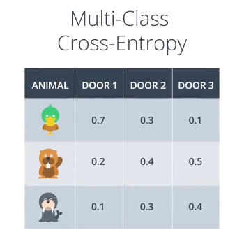

- The formula 

- - the negative of the summation from i_equals_one to n (different classes)
  - The summation from y_equals_j to m of Yij_times_the logarithm of Pij.

- This formular works because  Yij being zero one, which makes sure that we're only adding the logarithms      of the probabilities of the events that actually have occurred.

- The cross entropy for two classes and one for m classes, the formulas look different but they are      the same for m_equals_two
- Cross-entropy is inversely proportional to the total probability of an outcome

## 21. Logistic Regression

Basic procedures:

- Take your data
- Pick a random model
- Calculate the error
- Minimize the error, and  obtain a better model

**i) Calculating the Error Function**

- By convention we will actually consider the average, where we are dividing by n over here, this      will then turn the 4.8 into a 1.2
- When we combine our wx + b and sigmoid function of it, the error function will become something as      follow:   

- Our goal is to minimize the value
- <u>Multiclass classification problem</u>, the error is now given by the multiclass entropy

- Minimizing the error function:

- 1. We started some random weights

2. Each point will give us a larger function if it is mis-classified and a smaller one
   if it's correctly classified	

3. Minimize this function by gradient descent

1. We are going to try to jiggle the line around to see how we can decrease the error function

2. The error function is the height which is E(W,b), where W and b are the weights

3. We will use gradient decent in order to get to the bottom of the mountain at a much smaller height

4. Which ultimately gives us  smaller error function E of W',b'

5. 1. This will give rise to new weights, in which W' and b' will give us a much better prediction, which namely sigmoid(W'x +b')

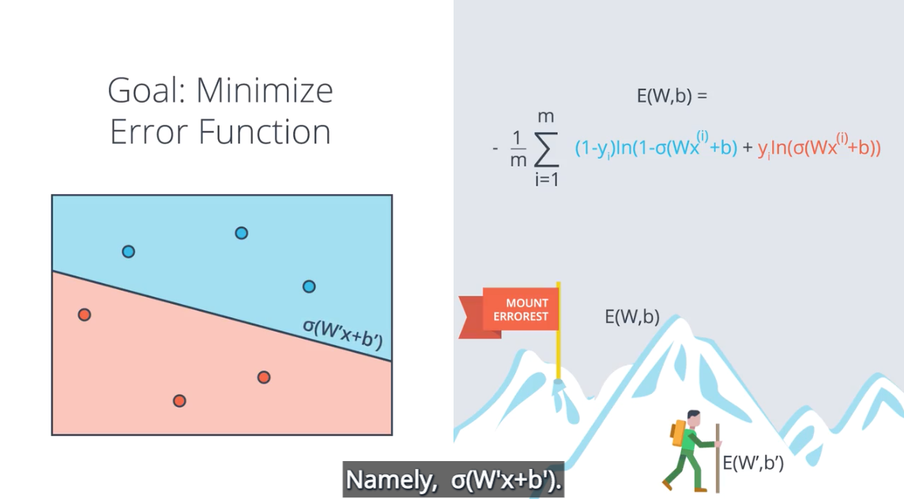

## 22. Gradient Descent

- We are standing somewhere in Mount Math-Er-Horn and we need to go down

- So now the inputs of the function are W1 and W2 and the error function is given by E

- Then the gradient of E is given by

- - The vector sum of the partial derivative of E with respect to W1 and W2
    ​              

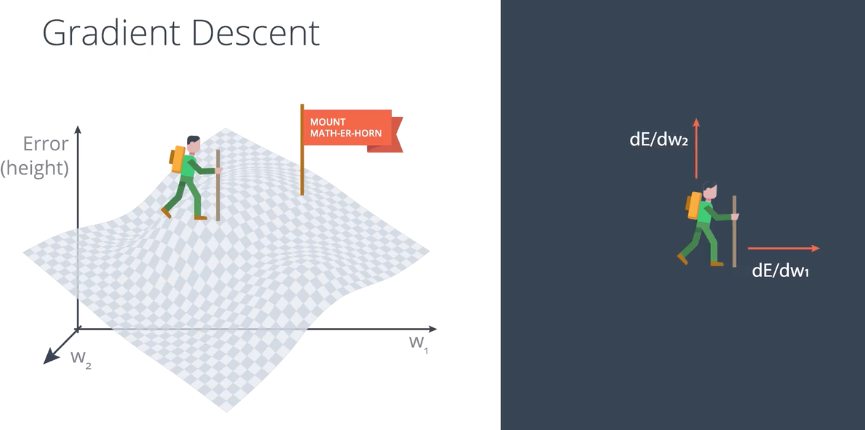

- This gradient actually tells us the direction we want to move if we want to increase
  the error function the most

- Thus if we take the negative of the gradient, this will tell us how to decrease the
  error function the most

- Therefore we will take the  negative of the gradient of the error function at that point
- Once we take a step in that direction, we will be in a lower position
- And we do it again and again until we are able to get to the bottom of the mountain

How to calculate the gradient descent?

- - As we do not want to make   any drastic changes, we will introduce a smaller learning rate alpha,       e.g. 0.1
    ​              
  - 
  - How do we update the weight and bias?
    ​            

- And we can conclude that the prediction we have now with weights W prime b prime

- The first thing to notice:

- - Sigmoid function has a really nice derivative

​	- Derivation of this

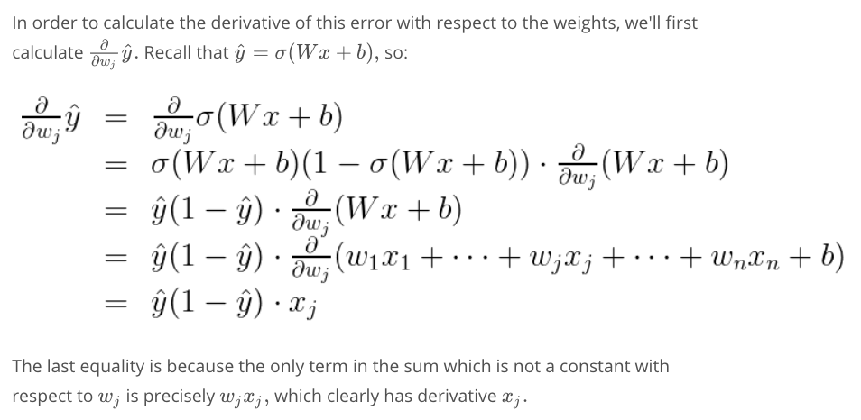

## 23. Gradient Descent Algorithm (pseudo code)

- Then we calculate the error for every point

- - The error is high for misclassified points
  - The error is small for correctly classified points

- For every point with coordinates x_1 up to x_n, we update as the followings:
  ​            

- We have just derived the derivatives in the above

- Repeat the process until the error is small (output W' and b')

## 24. Gradient Descent in Practice

Implementing Gradient Descent

download the repository via the command line with git clone <https://github.com/udacity/deep-learning-v2-pytorch.git>

 open the notebook GradientDescent.ipynb in the intro-neural-networks > gradient-descent folder

In this session, we will be implementing the functions that build the gradient descent algorithm, namely

- **Sigmoid**: The sigmoid activation function
- **Ouput_formular**: The formula for the prediction
- **Error_formula**: The formula for the error at a point
- **Update_weights**: The function that updates the parameters with one gradient descent step

## 25. Perception vs Gradient Descent

<u>Are they the same?</u>

The right and the left are exactly the same thing

- If points are incorrectly classified, points come closer

<u>Difference</u>

| Perceptron                               | Gradient Descent                                    |
| ---------------------------------------- | --------------------------------------------------- |
| Y-hat can only take ==only== one or zero | Y-hat can take any number ==between== zero          |
| If correctly classified, do nothing      | If correctly classified, changing move farther away |

## 26. Continuous Perceptrons

<u>Recap of Perceptron</u>

There will be a probability function where points on the blue/positive region have more chance of being blue, and the points on the red/negative region have more chance of being red.

- Label the edges by weights
- Label the node by the bias

<u>What the perceptron does</u>

​      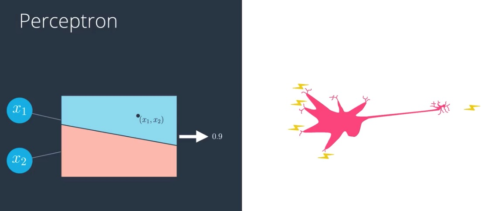

- It taks to point (x1, x2), then plots it in the graph and then returns a probability that the point is blue
- In this case, it returns a 0.9
- This mimics the neurons in the brain because they receive nervous impulses, do something inside and return a nervous impulse

## 27. Non-Linear Models

- In the case shown above, these data is not linearly separable, a line cannot divide these red and blue points.
- The goal of non-linear model is to find this **curve**. 

<u>What does a non-linear model does?</u>

- Create a probability function where the points
  - the blue region are more likely to blue
  - the points in the red region are more likely to be red
  - the curve that separates them is a set of points which are equally likely to be blue or red

## 28. Neural Network Architecture

### How to combine two perceptrons into a third, more complicated one?

- We are going to combine two linear model shown as above
- The two models over imposed creating the model on the right

- After combining two linear models, we have a neural model as above

<u>How to combine two models?</u>

- This line plus this line equals that curve

<u> How to do it in a mathematical way?</u>

- In the above linear model, we have one blue point in the blue region, so its probability of being blue is 0.7
- In the below linear model, we have the same blue point in the blue region, so its probability of being blue is 0.8
- The simplest combination: 0.7 +0.8 = 1.5
- As the number after combination is larger than 1, so we need to use sigmoid to turn it to a value between 1 and 0

<u>What if we want the model in the top to have more a saying the resulting probability than the second?</u>

- "Seven times the first one plus five times the second one"
- Take the first probability multiply by 7
- Take the second probability multiply by 5
- Add a bias (optional) = -6
- Apply sigmoid function and gives us 0.95

<u>Overall Speaking</u>

- It's a linear combination of the two linear models before / the line between the two models
- A linear combination of two models

- The first model times a constant + The second model times a constant + bias = non-linear model

- This is the building block of neural network

- Example

  

  

  

  

  

  - This can also be drawn using the notation that <u>keeps the bias a separate node</u>
  - A basic unit coming from a node with a one on it
    - The -8 on the top node becomes an edge labelled minus eight coming from the bias node

  <u>Exercise</u>

  

  - Remember need to apply the sigmoid function to the final output

### Multiple layer

neural networks can be more complicated

- Add more nodes to the input, hidden, and output layer
- Add more layers

* Input Layer
  * formed by more than one input
* Hidden Layer
  * a set of linear models created with this first input layer
* Output Layer
  * The linear models get combined to obtain a non-linear model

- The case with a larger hidden layer
- combining three linear models to obtain the triangulara boundary in the ouput layer

- The case for input layer with more nodes
- We are living in three-dimensional space
- Our linear model givs us a bunch of planes in 3D space
- The output layer bounds a nonlinear region in 3D space
- In general, <u>if we have n nodes in our output layer, then we are thinking a data living in n-dimensional space</u>

- The case for output layes has more nodes
- Then we just have more outputs
  - This is a multiclass classification model
    - e.g. The model is telling us if an image is a cat or dog or a bird
    - Then the output layer output a score for each one of the classes:
      - one for the cat
      - one for the dog
      - one for the bird

- The case if we have more layers
  - It is called a deep neural network
  - linear models combine to give nonlinear model and these combine to create even more nonlinear models

- In general, we can do this many times and obtain highly complex models with lots of hidden layers
- In the real world scenario, the neural network will split the n-dimensional space with a highly nonlinear boundary

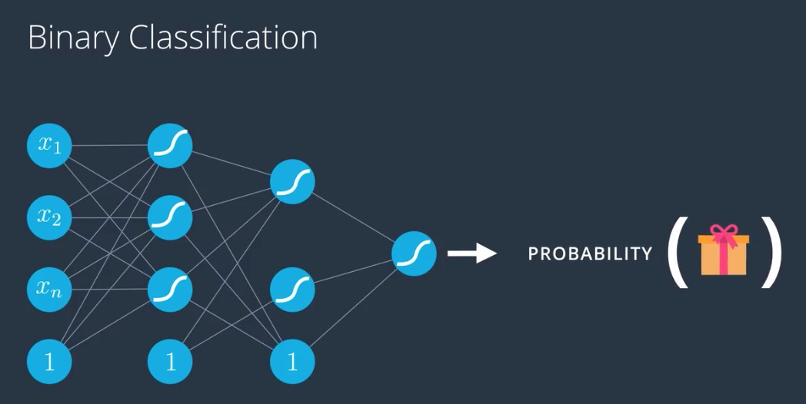

- If the model predicts a probability of receiving a gift or not, then the __answer just comes as the output of the neural network__

- we can create separate neural networks to predict if the image is a duck
- Then we can use the softmax to pick the answer that gives us the highest probability
- However, it's too much

  <u>A better solution</u>

- The first layers of the neural networks should be enough to tell us things about the image
- The last layer should tell us which animal it is

- So we need to add more nodes in the output layer
- Each of the nodes will give us the probability that the image is each of the animals
- We now take the scores and apply the SoftMax function to obtain well-defined probability

<u>Question:</u>

How many nodes in the output layer would you require if you were trying to classify all the letters in the English alphabet?

<u>Answer:</u>

To classify 26 letters you will need 26 nodes in the output layer. (Alternatively, 52 nodes for 26 uppercase and 26 lowercase letters)

## 29. Feedforward

It is the process neural networks use to turn the input into an output

<u>How they process the input to obtain an output?</u>

- This perceptron receives a data point of the form x1 , x2

- The label is Y=1, which means that the point is blue

- The perceptron is defined by a linear equation, w1, w2, x1 and x2 in the edges and B is the bias in the note

- w1 is bigger than w2

  - denote that by drawing the edge labelled w1 much thicker than the edge labelled w2

- What the perceptron does?

  1. It plots the point x1, x2

  2. It outputs the probability that the point is blue

- Output

  - Here is the point is the red area and then the output is a small number

- The aforementioned <u>process is known as feedforward</u>

  - this is a bad model because the point is actually blue

- We have thick edges corresponding to large weights and thin edges corresponding to small weights and the neural neural network plots
- The point in the top graph and also in the bottom graph and
  - the outputs coming out will be a small number from the top model
    - The point lies in the red area which means it has a small probability of being blue
  - the outputs coming out will be a small number from the top model
    - the point lies in the blue area, it has a large probability of being blue
- As the two models get combined into this nonlinear model, and the output layer just plots the point and it tells the probability that the point is blue
- Overall, this is a bad model, because it puts the point in the red area and the point is blue

- The matrix w superscript one denoting the first layer and the entries are the weights w11,w12,w21,w22,w31,w32
- The biases have now been written as w3
- We also have a matrix, in which w superscript two for the second layer
- The layer contains the weights that tell us how to combine linear models in the first layer to obtain the nonlinear model in the second layer
- Input
  - x1,x2
  - 1: bias unit
- Mathematic Process
  1. <u>Multiply input by the matrix w1</u> to get these outputs
  2. <u>Apply sigmoid function</u> to turn the outputs into values between zero and one
  3. The vector format these values gets a one attached for the bias unit and <u>multiplied by the second matrix</u>
  4. This returns an output that now gets thrown into a sigmoid function
  5. Finally, we can obtain the final output which is y-hat
     - Y-hat is the prediction/probability that the point is labelled blue
- General Speaking: what a neural networks do
  - They take the input vector and then apply a sequence of linear models and sigmoid functions
  - These maps when combined become a highly non-linear map

The final formular is

- Start with the unit vector x
- we apply the first matrix and then a sigmoid function to get the values in teh second layer
- apply the second matrix and another sigmoid function to get the values on the third layer and so on so forth until we get our final prediction
- This the feedforward process
  - Use to obtain the prediction from the input vector

  

- Our goal is train our neural network, we need to define our error function

- This function gives us a measure of the error of how badly each point is being classified
- This is a measure of how far the point is from the line and point is incorrectly classified
  - This is a very small number if the point is correctly classified 

- How are we going to define the error function in a multilayer percetion?
  - Our prediction is just a combination of matrix multiplications and sigmoid functions
  - The error function can be the exact same thing

- The only difference is that the y-hat is a bit complicated
- This function will tell us how badly a point get misclassified, as it is looking at a more complicated boundary

## 30. Backpropagation

**The way to train a neural network, the method is known as backpropagation**, it consists of:

- Doing a feedforward operation
- Comparing the output of the model with the desired output
- Calculating the error
- Running the feedforward operation backwards (backpropagation) to spread the error to each of the weights
- Use this to update the weights, and get a better model
- Continue this until we have a model that is good

### Conceptual Interpretation of what backpropagation is

### Single Layer Perceptron

- Description of model
  - it plots a point and returns a probability that the point is blue, in which this case is small since the point is in the red area
- Backpropagation
  1. Ask the point: "What do you want the model to do for you?"
  2. The point said: "I want this boundary to come closer to me"
  3. The line got closer to it by updating the weights
     - Let's say in this case, we obtain new weights, which defines a new line which is closer to the point
       - weight w1 goes lower
       - weight w2 goes higher

### Multi-Layer Perceptron

- Feedforward
  1. The point comes in with coordinates (x1, x2) and label y =1
  2. The point gets plotted in the linear models corresponding to the hidden layer
  3. These layers get combined and the point gets plotted in the resulting non-linear model in the output layer and the position of this point in the final model
  4. The model is not good because it predicts the point will be red when in reality the point is blue
- Backpropagation

1. What do want this model to do in order for your to be better classified?
2. The point says, "I want this blue region to come closer to me"
3. **What does it mean for the region to come closer to it**
   - <u>Which one of these models is doing better?</u>
     - the bottom one performs better, so we want to listen to the bottom one more and to the top one less
     - So we want to **reduce the weight coming from the top model**, and **increase the weight coming from the bottom model**
       - **which is indicated by the link between the final layer and the hidden layers**
   - <u>What can these models do to classify you better?</u>
     - The point in the upper model
       - "I want this line to move closer to me"
     - The point in the bottom model
       - "I want this line to move farther away from me"
     - To perform these two request from the point in both top and bottom model
       - It will increase two and decrease two in the input layer
4. So now after we update all the weights, 
   - we now have better predictions at all the models in the hidden layer
   - we also have a better prediction at the model in the output layer

Note : the above intentionally left the bias unit away for clarity, we need to update the weights we are also updating the bias unit

### Backpropagation Math

- Error function formula 
  - The average of all points of the blue term for the blue points and the red term for the red points
- Calculation of Gradient
  - simply the vector formed by all the partial derivatives of the error function with respect to the weights w1 up to wn and the bias b.
    - Correspond to the edges over here

- Multi-layer circumstances
  - prediction
    - composition of functions namely matrix multiplications and sigmoids
  - Error function
    - similar, only Y-hat is a bit more complicated 
  - Gradient
    - Same
    - Just much longer, it's a huge vector where each entry is a partial derivative of the error with respect to each of the weights

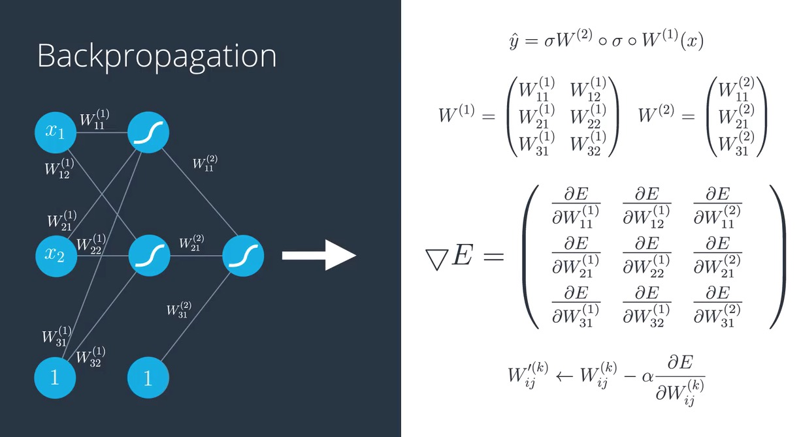

- Prediction
  - composition of sigmoids and matrix multiplications
- Gradient
  - formed by all these partial derivatives (it is just a long vector)
- Gradient Descent
  - take w_i_j super k and we update it by adding a small number
  - the learning rate times the partial derivative of E with respect to that weight
  - The new weight prime will classify the point much better

### Chain Rule

- If you have a variable x on a function f that you apply to x to get f of x, which we call A
- Another function: apply to f of x to get g of f of x, which we call B
- If we want to find the partial derivative of B with respect to x

- Partial derivative of B = partial derivative of B with respect to A times the partial derivative of A with respect to x
- **Insights**
  - When composing functions, that derivative just multiply
  - **it is useful because feed forwarding is also composing a bunch of functions**
  - **Back propagation is ==taking derivative at each piece==**
  - **Since we are taking the derivatives of a composition, it is the same as multiplying the partial derivatives, so we can just ==multiply a bunch of partial derivatives to get what we want==**

<u>Feedforward</u>

- 1st layer
  - h1, h2 --> linear function
- 2nd  layer
  - h --> linear function of linear functions
- 3rd layer
  - sigmoid(h)
  - result = prediction/probability between 0 and 1, which is Y_hat
- Overall equation (from left to right, inner most to outer most)
  - sigmoid of W superscript 2 applied to the input x
- 

<u>Backpropagation</u>

- Calculate the derivative of this error function with respect to each of the weights in the labels by using the chain rule

- Since the prediction is a function of all the weight Wij, the error function can be seen as the function on all the Wij

- Gradient

  - It is simply the vector formed by all the partial derivatives of the error function E with respecct to each of the weights

  - Example: ==Calculate derivative of E with respect to W11 superscript 1==

    - The derivative with respect to this

      - is the product of all the partial derivatives

    - We can calculate a derivative of this complicated composition function by just multiplying 4 partial derivatives

    - **Derivative of E with respect to Y_hat**

    - $$
      \hat{y} - y
      $$

Let's zoom to look at just one piece of our multi-layer perception

- Input

  - h1 and h2

- h is a sum of three things and only one of them contains h1

  - So the second and the third summon just give us a derivative of 0

  - The derivatives of the sigmoid (h1):

    $$
    \sigma(h_1)[1-\sigma(h_1)]
    $$

  - how to calculate derivatives of the sigmoid(h1)

    

## 31. Training Optimization

When we are training our neural network, sometimes we will find out that nothing works as planned:

- Many things can fail 
  - Architecture can be poorly chosen
  - Data can be noisy
  - Model could be taking years to run and we need it to run faster
- Therefore we need to learn ways to optimize the training of our model

## 32. Testing

- The question is which of these two models is better?
  - It seems like the one on the left is simpler a line and the one the right is more complicated since it's a complex curve
  - But by looking at how many mistakes the model make
    - right: no mistake, is it really better?
  - In order to find out which one is better, we must separate the dataset into training and test set

- **Training Set**: the solid color points
- **Test Set**: the points with the white inside are testing set

- We train the training set without looking at the testing set

- Then we evaluate the results on that testing to see how we did

- We apply the simple and complex model on the training set to obtain these two boundaries

- Reintroduce the testing set and we can see the model in the left made one mistake while the model in the right made two mistakes
- The simple model was better
  - **Whenever we can choose between a simple model that does the job and a complicated model that may do the job a little bit better,  we always choose the simpler model**

## 33. Overfitting and Underfitting

Two types of problem

1. underfitting
   - we are trying a solution that is too simple and won't do the job
2. overfitting
   - We add extraa complexity when we can use a much simpler solution instead

- It's too simple, it doesn't even get the entire training data set right
  - misclassified the cat

- It is way too specific, when a new dog is put in the test set, it will be misclassified, which implies the model fail to generaliz

- Exam scenario
  - Underfitting
    - Not study enough and failing
  - Overfitting
    - can do any questions in the textbook but we won't able to generalize and answer well in the exam

- Left: 
  - underfits since it is too simple
  - the data is more complicated than that
  - over simplistic architecture (e.g. just one perceptron)
- Right:
  - over fits since it tries to fit the data with an overly complicated curve
  - It fits the data really well since it makes no mistakes
  - it get confused by the misclassified point because it tries to feed it too well
  - highly neural network with more layers and weights than we need
- Middle
  - Make the mistakes over here, but generalize better
  - It looks at the misclassified point as noise

<u>Problem</u>

- __It is really hard to find the right architecture for a neural network__, because it is either
  - ==very simplistic architecture==
  - ==over complicated one==

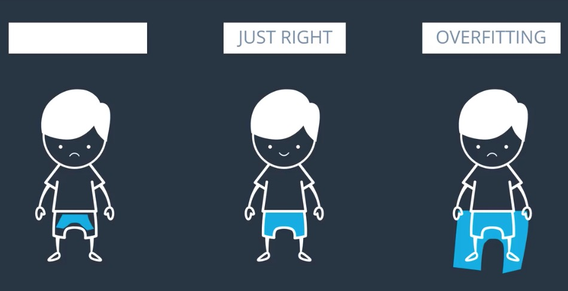

- It is like trying to fit in a pairs of pants, if we we cannot fit our size, what do we go for bigger pants or smaller pants?
  - Intuition
    - Find a slightly bigger pants and then try to get a belt (optimizer)
  - Logic dervied by the above intuition
    - we tend to in the error side of an overly complicated model
    - apply certain technique to prevent overfitting on it

## 34. Early Stopping

- Epoch =  1
  - underfit
- Epoch = 20
  - pretty good model
- Epoch = 100
  - start overfitting
- Epoch = 600
  - heavily overfitting
  - the blue region is pretty much a bunch of circles around the blue points, therefore it will generalize horribly (the new point should lie very close to the point in the training set in order to classify in a correct way)
- Above graph
  - dotted line
    - testing error
    - **It decreases as the model generalizes well until it gets to a minimum point - the Goldilocks spot**
    - Once we pass that spot, the model starts over-fitting since it stops generalizing and just starts memorizing the training data
  - solid line
    - training error
    - **always decrease when we increase the EPOCH**

### Complexity Graph

- Y-axis: error

- X-axis: measure of the complexity of the model (in this case = number of Epochs)

- Insight of the graph

  - **We degrade in descent until the testing error stops decreasin and starts to increase, at the moment we stop**
  - This algorithm is **called Early Stopping** and it is widely used to train neural networks

  ## 35. Regularization

- 

- Solution 2 is really a scalar multiple of solution 1
- First Model
  - for point(1,1), sigmoid of (1+1) = 0.88 (should be very positive, since it is blue)
  - for point(-1,-1), sigmoid of (-1-1) = 0.12 (should be less(approach 0), since it is red)
    - it's not best since a point label has a label of zero since it's red
- Second Model
  - for point(1,1), sigmoid of (10+10) = 0.9999..., which is close to 1
  - for point(-1,-1), sigmoid of (-10-10) = 0.000000..., which is close to 0
  - Therefore the second model is super accurate
  - However, the second model is more likely to be overfitting

- Left Hand Side
  - Take sigmoid of X1 + X2
  - The function has a nice slope to the gradient descent
- Right Hand Side
  - Take a sigmoid of 10X1 + 10X2
  - Predictions are much better since they are closer to zero and one
  - But the function becomes much steeper and it's much harder to do great descent here
- __Key insight__: In order to do gradient descent properly, we want a model like the one in the left more than a model like the one in the right. 
  - It is because the RHS model gives little room for applying gradient descent
    - The points that are classified incorrectly in the model in the right, will generate large errors and it will be hard to tune the model to correct them

### How do we prevent this "subtle" type of overfitting from happening?

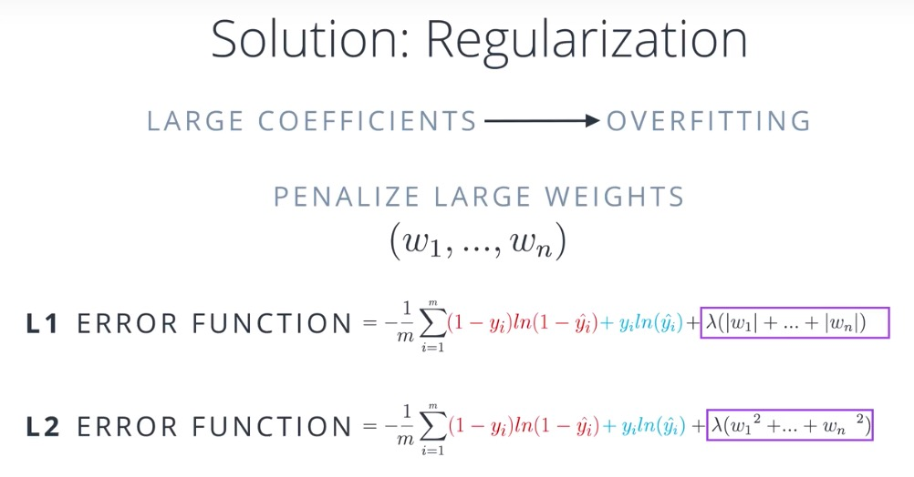

- General Idea
  - In the old error function, we add a term which is big when the weights are big
  - There are two ways to do it
    1. **L1:** Add the sums of absolute values of the weights times a constant lambda
    2. **L2:** Add the sum of the square of the weights times taht same constant
  - Commalities
    - these two are large if the weights are large, we penalized them a lot
    - if lambda is small, then we do not penalize them much

### What are guidelines for deciding between L1 and L2 regularization?

- Apply L1, we tend to __end up with sparse vectors__
  - Small weights tend to go to zero
  - So if we want to reduce the number of weights and end up with a small set, which is good for feature selections
    - sometimes we have a problem with hundreds of features, this method will __help us select which features are important__
- Apply L2
  - Tends not to favor sparse vectors since it tries to __maintain all the weights homgenously small__
  - This one normally gives better results for training model, so we 
- Why L1 an L2 have the aforementioned properties?
  - If we take the vector (1,0)
    - the sums of the absolute values of the weights are one
    - the sums of the squares is one
  - __If we take the vector (0.5,0.5)__
    - the sums of the absolute values of the weights is still one
    - the sums of the squares is 0.25 + 0.25, which is 0.5
    - L2 regularization will prefer the vector point (0.5,0.5) over the vector (1,0), since this one produces a smaller sum of squares, and in turn a smaller function

## 36. Dropout: another way to prevent overfitting

- You do different sports with **dominant hand(right)** everyday, so you only train up your muscle on that arm but not on the other arm

- Monday, you tie up your right hand to play tennis

- Tuesday, you tie up your left hand to lift weight

- Wednesday, tie up your right hand to play rugby

- so on so forth, and you will be able to train up muscles on both arms

- Sometimes one part of the network has very large weights and it ends up dominating all the training while another part of the network doesn't really play much of a role so it doesn't get trained
- General idea
  - ==turn one node off and let the rest of the network train==

- For example, if we give it a 0.2, it means each epoch, each node gets turned off with a probability of 20 percent
- Notice that some nodes may get turned off more than others and some others may never get turned off, this is ok since we are doing it over and over 
- On average each node will get the same treatment

## 37. Local Minima

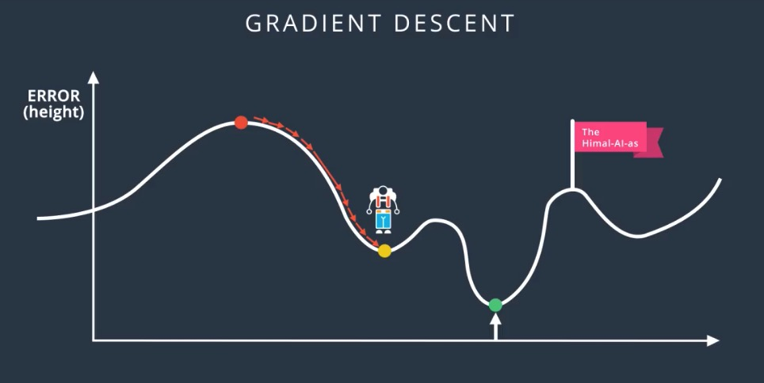

- The green point is Himalayans's  lowest point that we want to go 
- If we do gradient descent, we get all the way to the yellow point 
- We look around ourselves and there's no direction where we can descend more since we are at a local minimum, in which gradient descent itself doesn't help 

## 38. Random Restart: solution to local minima

- Start from a few different random places and do gradient descend from all of them

- This increases the probability that we will get to the local minimum or at least pretty good local minimum

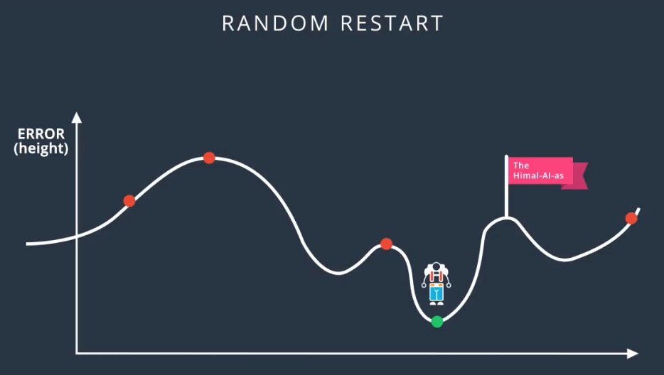

## Vanishing Gradient

- The curve gets pretty flat on the sides
- So if we calculate the derivative at a point way at the right or way at the left, the derivative is almost zero
  - This is not good cause a derivative is what tells us in what direction to move

- This gets even worse in most linear perceptron
- The derivative of the erro function with respect to weight was the product of all the derivatives calculated at the nodes in the correspond path to the output
  - All these derivatives are derivatives as a sigmoid function, so they are small
  - The product of small numbers is tiny

- This make the training difficult because basically grading the [inaudible] give us very, very tiny changes to make on the weights, which means we make very tiny steps and we will never be able to descend Mount Everest

## 39. Other Activation - Solve Vanishing Gradient

- The best way to fix this is to change the activation function
- Other activation functions, include:

- This activation function is similar to sigmoid
- but the range is between minus one and one, therefore the derivatives are larger
- This small progress has led great advances in neural networks

- If you are positive, it will return the same value
- If you are negative, it will return zero
- Another way of seeing it is as the maximum between x and zero
- It is used a lot instead of the sigmoid and it can improve the training significantly without sacrificing much accuracy
  - Since the derivative is one if the number is positive (positive slope)
- This function barely breaks linearity can lead to such complex non-linear solutions

- With btter activation fucntions, when we multiply derivatives to obtain the derivative to any sort of weight, **the products will be made of slightly larger numbers which will make the derivative less small, and will allow us to do gradient descent

- We will represent the ReLU unit by the drawing of its function
- The above example of a Multi-layer Perceptron with a bunch of ReLU activation units
- **The last unit is a sigmoid, since our final output still needs to be a probability between zero and one**
- **However, if we let the final unit be ReLU, we can end up with regression models, the predictive value**

## 40. Batch vs Stochastic Gradient Descent

- We take a bunch of steps following the negative of the gradient of the height
- **Each step is called an epoch**
- **When we refer to the number of steps, we refer to the number of epochs**

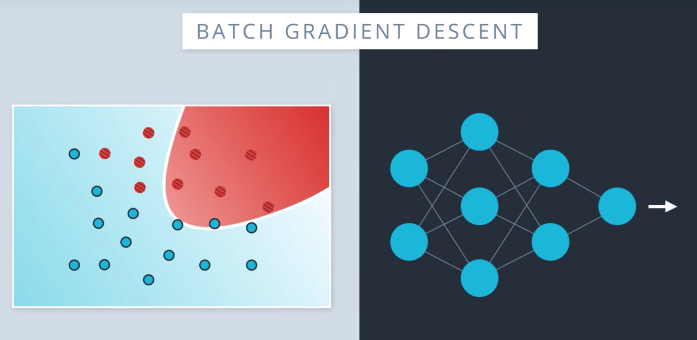

- What happens in each epoch?
  - In each epoch, we take our input, **namely all our data** and **run it through the entire neural network**
  - We calculate the error, namely how far they are from where their actual labels
  - We back-propagate this error in order to update the weights in the neural network
  - This will give us a better boundary for predicting our data
- **However, if we have many many data points, which is the common case, these are huge matrix computations, it will use tons of memory and all that just for a single step**
- **this would take a long time and lots of computing power**

**<u>Do we need to plug in all our data every time we take a step?</u>**

Answer: 

- No, because if the data is well distributed, a pretty good idea of what the gradient would be

- May be it is not the best estimate for the gradient, but it is a lot quicker

- **This is where stochastic gradient descent comes into play**

  - General idea

    - It is simply taking a small subsets of data, run them through the neural network, calculate the gradient of the error function based on those points and then move one step in that direction

  - What it actually does?

    1. we have 24 points

    2. we split them into 4 batches of 6 points

    3. we take the points in different batches and run them through the neural network

    4. calculate the error and its gradient

    5. Back-propagate to update the weights

    6. This will give us new weights, which will define a better boundary

**Note that normal gradient descent only took one step with all the data, while stochastic gradient descent will take multiple steps**

- Of course, more steps we took were less accurate, but in practice it is much better to take a bunch of slightly inaccurate steps than to take one good one

## 41. Learning Rate Decay

- If your learning rate is too big, then you are taking a huge step which could be fast at the beginning but you may miss the minimum and keep going which will make your model pretty chaotic
- If you have a small learning rate you will make steady steps and have a better chance of arriving to your local minimum
  - This makes your model very slow

**A good rule of thumb**

- If your model is not working, decrease the learning rate

- The best learning rates are those which decreases as the model is getting closer to a solution (keras has some operations which allow us to do so)

## 42. Momentum- another way to solve a local minimum

- General idea
  - Walk a bit fast with momentum and determination in a way that if you get stuck in a local minimum, you can power through and get over the hump to look for a lower minimum

- Now we ant to go over the hump but by now the gradient is zero or too small, it won't give us a good step
- What if we look at the previous ones? (e.g. the average of the last few steps)
- If we take the average, this will take us in direction and push us a bit towards the hump
  - the average seems a bit drastic since the step we made 10 steps ago is much less relevant than the step we last made

- The better way to take an average of previous steps
  - **We can weight each step so that the previous step matters a lot and the steps before that matter less and less**
  - This is momentum
    - it is a constant beta between 0 and 1 that attaches the steps as follows:
      1. The previous steps get multiplied by 1
      2. the one before, by beta
      3. the one before, by beta square
      4. the one before, by beta cube, so on and so forth
    - In this way, the steps that happened a long time ago will matter less than one the ones that happened recently
    - We can see that this gets us over the hump
    - Once we get to the global minimum, it will be pushing us away a bit but not as much

